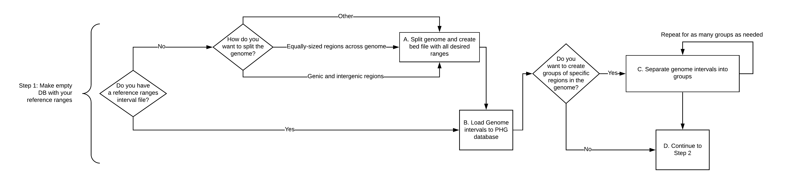
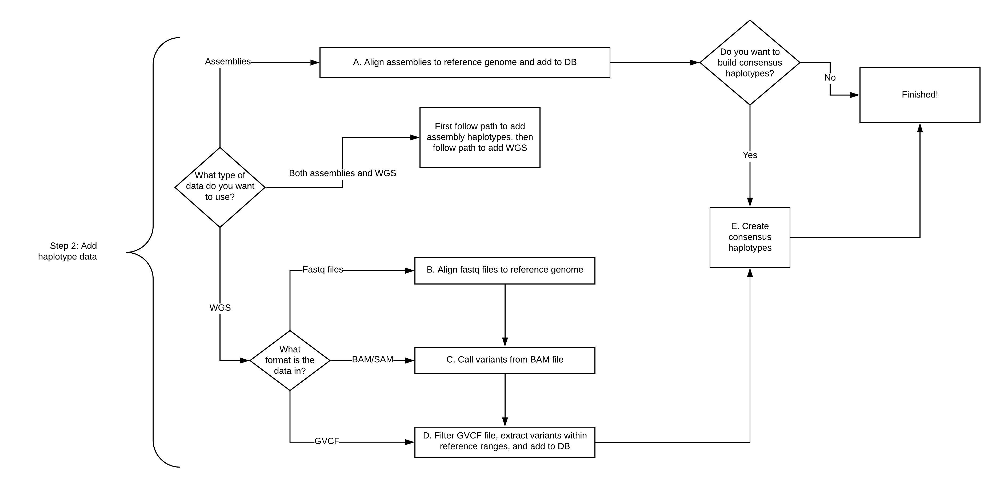
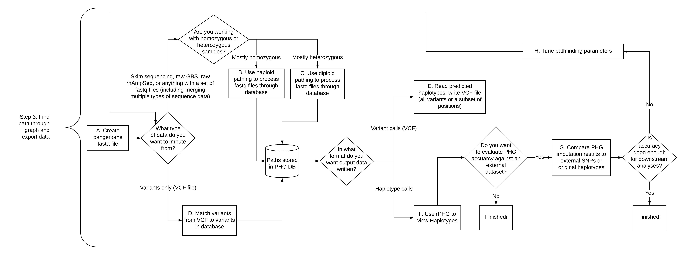
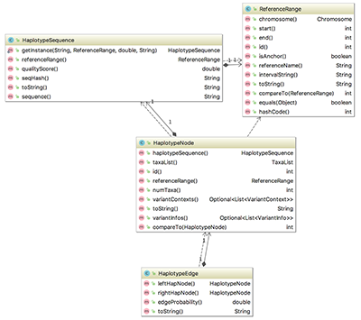
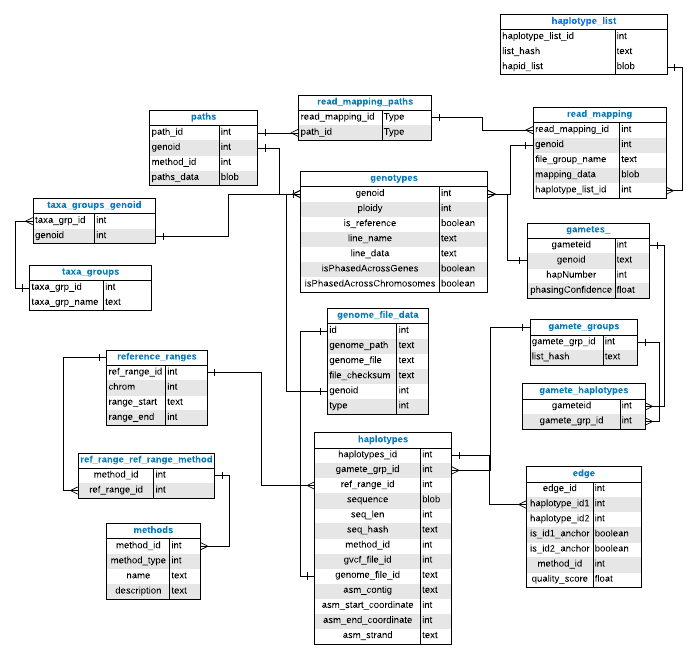

# How to use the PHG
A Practical Haplotype Graph can be used for many types of data processing and analysis. You can build a PHG from genome assembly-quality genomes or whole-genome resequencing data and use it to impute either variants or haplotypes, both for taxa within the database and for new taxa that are not included in the DB. A non-exhaustive list of possible use cases includes:

1. I want to populate a db using WGS
2. I want to populate a db using Assemblies 
3. I want to create consensus haplotypes
4. I have skim sequencing and I want variant information
5. I have sparse SNPs and I want to imputate more SNPs
6. I have a bunch of old/varied sequencing data and I want to merge them to get one set of variant calls on the same set of loci
7. I want to phase my heterozygous material by finding paths through db
8. I want to phase the assemblies I am putting into the db
9. I want haplotype information so I can choose populations to fine map traits
10. I want haplotype information for association analysis and/or GS
11. I want to understand recombination/haplotype formation in my population/species
12. I want to identify ancestral haplotypes & study haplotype quantity/diversity
13. I want to study rare haplotypes
14. I have some material and want to figure out what its parents are
15. I have some material and want to figure out what it is similar/related to
16. I want to do chromosome painting
17. I want to check the quality of some assemblies

The data needed for any of these use cases can be produced through one of two pipelines. Users can either create and populate a new PHG database, or can download and use an existing PHG database to impute variant or haplotype information. Follow the decision flow charts to see how to move through each pipeline. More information about each step can be found by clicking the link associated with that step. 

## *Download and install the PHG Docker*
**The PHG code can be downloaded and run with either Docker or Singularity.**

A. [Run PHG with Docker](UserInstructions/CreatePHG_step0_docker.md)

B. [Run PHG with Singularity](UserInstructions/CreatePHG_step0_singularity.md)

## *Create a PHG database and populate it with haplotypes*
**The first step is building an empty PHG database and optionally splitting reference range intervals into different groups of interest. The second step is adding haplotypes (from assemblies, WGS, or both) to that database, with an optional consensus building step. These steps can be run simultaneously. Click on the image to learn more.**

*[Step 1: create an initial PHG with reference data](UserInstructions/CreatePHG_step1CreateDB_loadRef.md)*

*[Step 2: add haplotypes](UserInstructions/CreatePHG_step2AssemblyAndWGSHaplotypes.md)*

## *Use an existing PHG database to impute variants or haplotypes*
Once you have a PHG database with haplotypes, the next step is to use that database to impute variants or haplotypes for new taxa. 
If you have not already downloaded the PHG docker, follow Step 0 above. You may also need to update the PHG database (Step 2.5) 
before moving on to Step 3. The pipeline plugins, MakeInitialPHGDBPipelinePlugin, PopulatePHGDBPipelinePlugin, and ImputePipelinePlugin,
always run this check as a first step. As a result, if you use those plugins, step 2.5 does not need to be run. Also, if you have just completed Step 2 then you can skip step 2.5. If you are running
one of the component plugins outside the pipeline and want to make sure that your database is in sync with the current version
of the PHG software, then run step 2.5.

*Step 2.5: Optional (see above) [Update PHG database schema](UserInstructions/UpdatePHGSchema.md)*

*[Step 3: impute variants or haplotypes](UserInstructions/ImputeWithPHG_main.md)*

# Additional information

## *PHG config files*
The current version of the pipeline expects almost all parameters to be set in a config file. While it is possible to 
set parameters from the command line for individual plugins, the number of parameters makes doing so impractical. Also, the pipeline
plugins call other plugins in turn. As a result when using the pipeline plugins, some parameters must be specified in a config file. Because of the number
of parameters, we provide two separate sample config files, one for steps 1 and 2 (creating a database and populating it with haplotypes) 
and one for step 3 (imputing variants). See those pages for details.

## *PHG key files*
You will need three types of key files with various portions of the PHG code. They are as follows:

1. Assemblies key file - associates chromosome fastas for assembly genomes with the name you ewant that taxon to have within the PHG database. These can include information for a [single assembly](Files/assemblies_keyfile1.txt), or for [multiple assemblies](Files/assemblies_keyfile2.txt).
2. [Haplotype key file](Files/haplotype_keyfile.txt) - associates specific WGS files with the name you want that taxon to have within the PHG database.
3. [Pathfinding key file](UserInstructions/ImputeWithPHG_findPathKeyFiles.md) - associates paired-end read files for pathfinding step.

## *Example database*
A small example database for testing the PHG can be found on the [Example Database](UserInstructions/ExampleDatabase.md) page 

## *PHG Application Programming Interface (API)*

[API Documentation](https://tassel.bitbucket.io/phg/javadoc/)

## *PHG Database Schema*

[Return to Wiki Home](Home.md)
