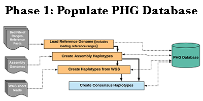
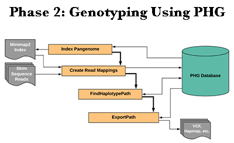
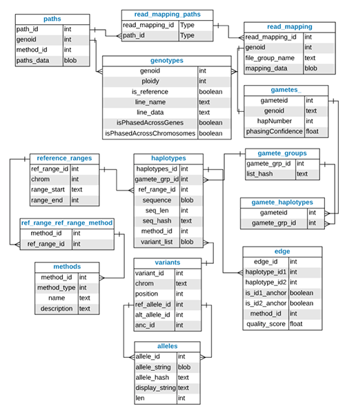
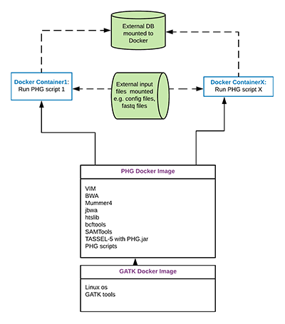

# [Practical Haplotype Graph (PHG)](https://drive.google.com/open?id=1oavzrgqaA_FWKK077uAVQdDgGb683W_y)

With improved sequencing technology, sequencing costs are declining very rapidly. But bioinformatics challenges for processing data and inferring genotypes have increased. To address this, we have developed a general, graph-based, computational framework called the Practical Haplotype Graph (PHG), that can be used with a variety of skim sequencing methods to infer high-density genotypes directly from low-coverage sequence. The idea behind the PHG is that in a given breeding program, all parental genotypes can be sequenced at high coverage, and loaded as parental haplotypes in a [relational database](https://drive.google.com/open?id=1ZmxJ1gD7iqFf5205WXA7qnt3efKbQ2RY). Progeny can then be sequenced at low coverage and used to infer which parental haplotypes/genotypes from the database are most likely present in a given progeny.   

Practical Haplotype Graph: 
The PHG is a trellis [graph](https://drive.google.com/open?id=1NChUJd3ab9nr2lxCWankwNRpPaazr7A_) based representation of genic and intergenic regions (called [reference ranges](https://drive.google.com/open?id=13CZTN9yHsvlwJFTMnLQPJpZemEh3Tsn-)) which represent diversity across and between taxa.  It can be used to: create custom genomes for alignment, call rare alleles, impute genotypes, and efficiently store genomic data from many lines (i.e. [reference](https://drive.google.com/open?id=1-dxLMY6oMbedoh-bztywtxhSGnT6SnuB), [assemblies](https://drive.google.com/open?id=1Ffk3rKy0XmwE2MMYr0rtg3qRKqell9XP), and [other lines](https://drive.google.com/open?id=1jv1lfPQViQrmbu9FL7mEaGsXIZPTRkWW)). [Skim sequences](https://drive.google.com/open?id=1CtxBo41GnmPyg3z_AgQWa8626857gFeZ) generated for a given taxon are aligned to [consensus sequences](https://drive.google.com/open?id=1HGr0h-1VIQzWJO0pO57FNmBpZRy4xcPP) in the PHG to identify the haplotype node at a given anchor. All the anchors for a given taxon are processed through a Hidden Markov Model (HMM) to identify the [most likely path](https://drive.google.com/open?id=1EZl5C9UMIkPvvWi7GdDrqe0PpQnsmkZl) through the graph. Path information is used to identify the variants (SNPs). Low cost sequencing technologies, coupled with the PHG, facilitate the genotyping of large number of samples to increase the size of training populations for genomic selection models. This can in turn increase predictive accuracy and selection intensity in a breeding program.

A more detailed introduction can be seen in Peter Bradbury's [PHG presentation slides](Pipeline_version1/PAG_Bradbury_PHG_ver3.pdf) from the 2018 Plant and Animal Genome conference (PAG).

View also the [2018 PAG poster](Pipeline_version1/Poster_PAG2018_PR.pdf).

## *PHG Docker Pipeline*

[](images_version1/PopulatePHGDatabaseLarge.png)
[](images_version1/GenotypeUsingPHGLarge.png)

## *PHG Application Programming Interface (API)*

[API Documentation](https://javadoc.io/doc/net.maizegenetics/phg/latest/index.html)

[](images_version1/PHGAPILarge.png)

## *PHG Database Schema*

[](images_version1/PHGSchemaLarge.png)

## *PHG Database Support*
The PHG pipeline currently supports SQLite and postgres databases outside of a docker, as well as postgres database inside a docker. Our intent is for users to migrate to the dockerized postgres database.

Access to PHG databases in all cases is through a config file that specifies the host:port, user,  password, db name, and the database type (sqlite or postgres).  An example of an SQLite config file is below. NOTE: The user and password parameters are not used for SQLite.  The sqlite db file must include a path that is relative to it's location within the PHG docker scripts. This will be discussed when each script is discussed.

```
#!python

host=localHost
user=sqlite
password=sqlite
DB=/tempFileDir/outputDir/phgTestDB_mapq48.db
DBtype=sqlite
```


An example of a postgres config file is below:
```
#!python

host=199.17.0.7:5432
user=postgres
password=postgresPWD
DB=phgdb
DBtype=postgres
```
### [PHG Postgres Docker](Pipeline_version1/PHG_PostgresDocker)

### [PHG Database Migration](Pipeline_version1/PHG_Liquibase)

## *PHG Docker Instances*
The PHG is deployed as a Docker image.  Docker is an open source platform that wraps applications into an image to be deployed on a host system.  Docker containers are instances of a Docker image that may run simultaneously on the same host.  See the Docker documentation [here](https://docs.docker.com) for details.

The PHG Docker image is built on the GATK image from [docker hub](https://hub.docker.com).  To this image the following analysis tools are added:  VIM, BWA, minimap2, jbwa, htslib, bcftools, SAMTools and TASSEL-5 with the PHG jar.  In addition, scripts for loading and processing the PHG are added. 

To pull the PHG images from docker hub, run the following commands (the second pull is only necessary if you are pulling a new PHG image to run against an existing database file):


```
#!python

docker pull maizegenetics/phg
docker pull maize genetics/phg_liquibase

```
 
If on a Cornell CBSU machine, use docker1 as below:


```
#!python

docker1 pull maizegenetics/phg
docker1 pull maizegenetics/phg_liquibase
```

ON cbsu:
 NOTE: If unable to pull a docker image from docker hub on a Cornell CBSU machine, check
  if you are on an enhanced security machine.  cbsumm01, 03, 11 and others are.
  You can see this if you go to basic biohpc reservations pages, and look
  at the machines you're able to reserve.  They will have a note in the description
  about enhanced security.

  "certificate signed by unknown authority"  (see above - enhanced security machine)

[](images_version1/PHGDockerDiagramLarge.png)

## *Docker Pipeline Phase 1 Details*
Phase 1 of the pipeline is concerned with populating the database with reference, assembly (optional) and haplotype sequence data.  In addition, consensus anchor sequences are determined from those haplotype sequences currently in the database.  To create the data for each of these steps there is a shell script provided within the Docker image. These scripts live at the root directory in the Docker linux tree.   The functionality performed in each script is defined below.  

These scripts may be run from within a Docker container or on the command line that creates the docker container.  The description of each script includes an example Docker command that creates a container and runs the specified script.

The first step is to create reference intervals to be used in the pipeline.  The reference intervals are generally conserved regions identified from your reference genome.  They may be based on any algorithm you choose.  Sometimes it is the gene regions from gff files, but could be exon or any other regions, or even something arbitary, e.g. every 1000 bps of the reference genome.  Any region not specified in the reference intervals file will be considered as an inter-genic (or non-conserved) region.

The output required is a tab-delimited file in bedfile format (positions are 0-based, start position is inclusive, end position is exclusive), containing columns for "chr", "startpos" and "endpos" as the first 3 columns.  Other columnns and data may be present but will be ignored.  Headerlines must begin with # and will be skipped.  

After successfully creating the reference intervals file the LoadGenomeIntervals.sh script must be run to create the initial database with reference intervals and haplotypes for the reference genome.

### [LoadGenomeIntervals.sh](Pipeline_version1/LoadGenomeIntervals)  

The following pipeline steps may be run or skipped, depending on your intended use of the PHG database.  See the individual wiki pages for details.
### [LoadAssemblyAnchors.sh](Pipeline_version1/LoadAssemblyAnchors)
### [ParallelAssemblyAnchorsLoad.sh](Pipeline_version1/ParallelAssemblyAnchorsLoad)
### [CreateHaplotypes](Pipeline_version1/CreateHaplotypes)
### [CreateConsensi.sh](Pipeline_version1/CreateConsensi)

## *Docker Pipeline Phase 2 Details*
Phase 2 of the pipeline uses the stored haplotype graph data to infer genotypes from skim sequences and is split into 2 sub-phases. A path through the graph may be determined based on specific haplotype nodes or based on consensus sequences.  Once a path is determined, it is stored in the database paths table.  The haplotype node ids from the haplotypes table that comprise the path are exported to a file.  The paths can then be used to export a VCF file containing the Genotyped SNPs for the taxon processed.

The Two sub phases are as follows.
 
* The first phase(Phase 2a) simply extracts the haplotypes from the DB and writes a pangenome fasta file.  Then the Fasta File is indexed using minimap2. **This step only needs to be executed once**

* Phase 2b then takes this index file and aligns reads using FindPathMinimap2.sh then can export the Path to a VCF using ExportPath.sh

The shell scripts to find and export the paths are located in the root directory of the Docker image.  These scripts are described below. 

As with the Phase 1 pipeline, these scripts may be run from within a Docker container or on the command line that creates the docker container.  The description of each script includes an example Docker command that creates a container and runs the specified script.

### [IndexPangenome.sh](Pipeline_version1/IndexPangenome)
### [FindPathMinimap2.sh](Pipeline_version1/FindPathMinimap2)
### [ExportPath.sh](Pipeline_version1/ExportPath)

# How to ask for help and report bugs

## Asking questions

Please use Biostars to ask for help. Instructions for using Biostars are [here](Pipeline_version1/help_biostars.md)

### PHG Workshop (June 4-8, 2018): Cornell University - Ithaca

[Agenda](https://drive.google.com/file/d/1G7h1eqc_LZ7OV0FU3oOANTYsXyZVij9t/view?usp=sharing)

[Presentations](https://drive.google.com/drive/folders/1egsVyumoZLVkbSdv2TBelKPfID122fcT?usp=sharing)

### PHG Workshop (August 17-18, 2018): IRRI - Philippines

[Agenda](https://drive.google.com/file/d/10YIeHtHE0v4EdCg9U1mbhvcT4W6pXL5M/view?usp=sharing)

[Presentations](https://drive.google.com/drive/folders/1rnN1TtjRKvLITvvFDJL7dD0WMSpcIgPQ?usp=sharing)