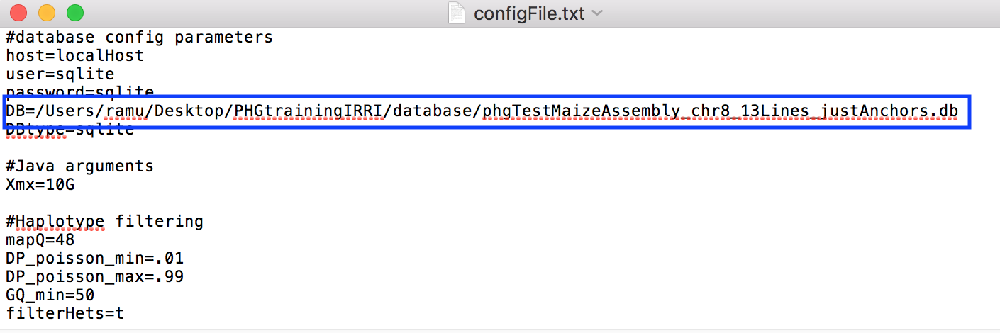
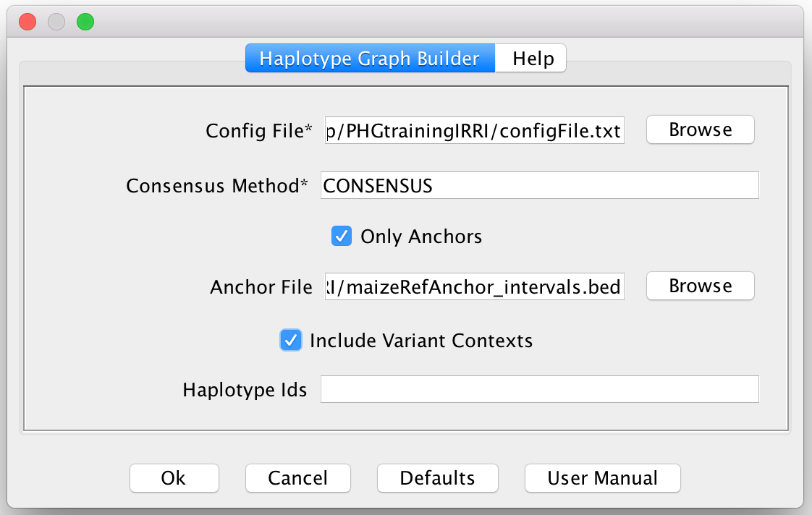
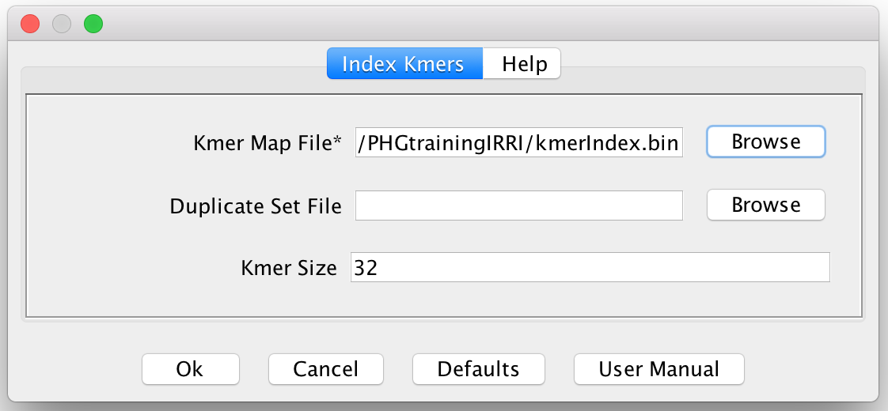
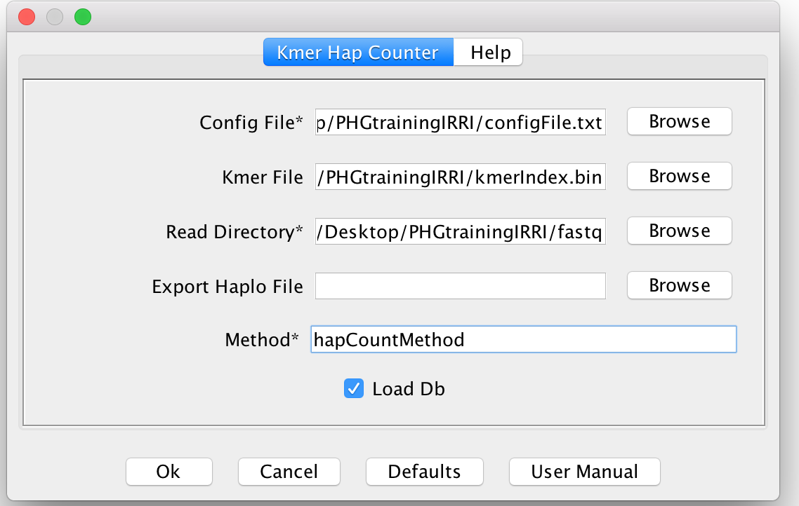
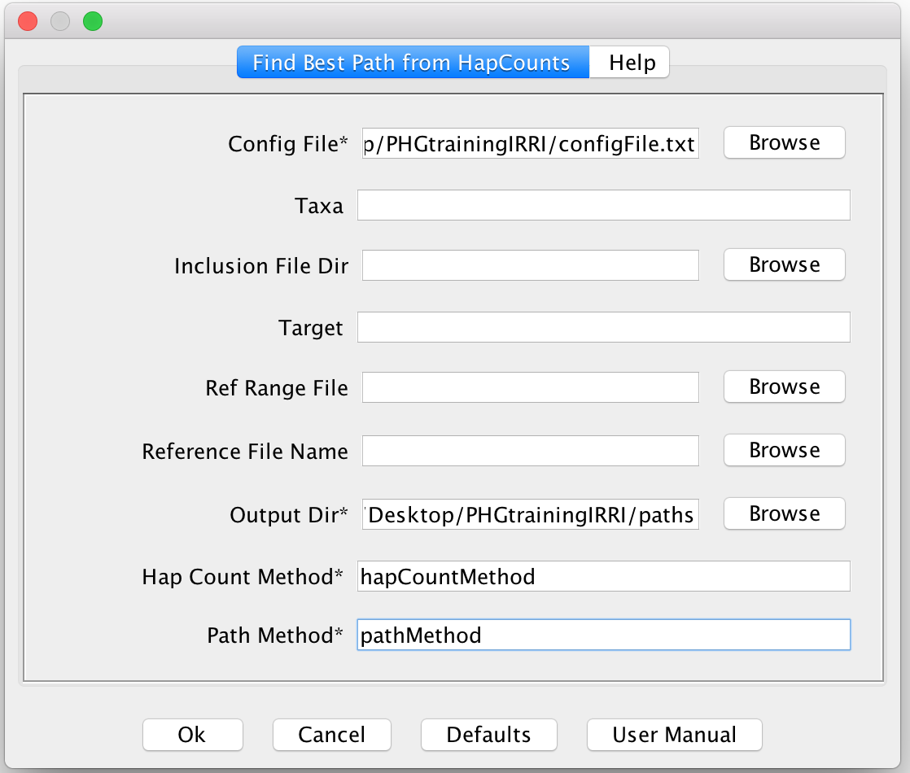
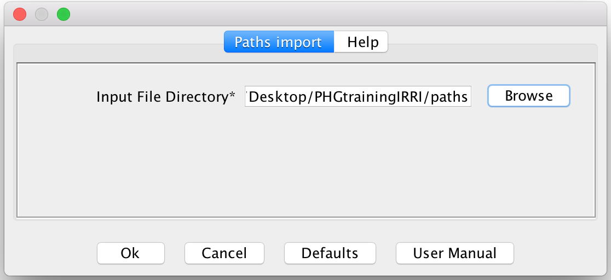
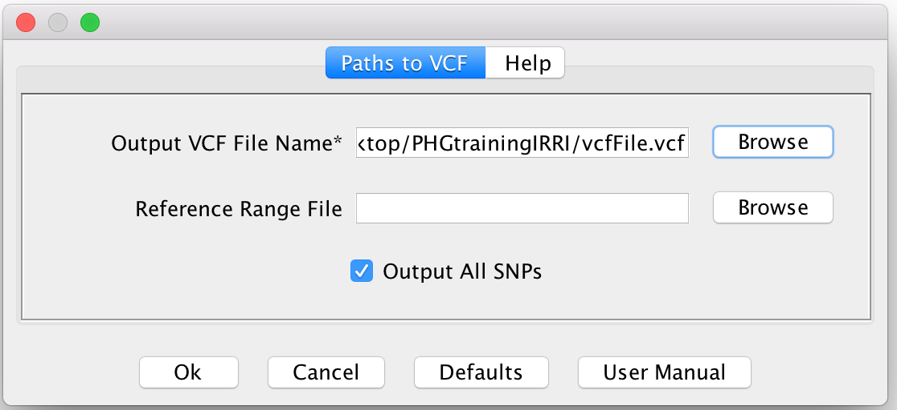

# Documentation for Genotyping using the PHG within TASSEL GUI

## Steps Original Pipeline:
1. Update Config file with local directory.  On windows, the '/' character can be used to find the correct path
2. Extract the HaplotypeGraph from the DB using HaplotypeGraphBuilderPlugin.
3. Create Kmer index.
4. Extract out Haplotype Counts for the Skim Sequence reads using FastqToHapCountPlugin.
5. Find Paths through the HaplotypeGraph for each taxon using HapCountBestPathToTextPlugin.
6. Create a VCF file using PathsToVCFPlugin.

# Create Screen shots for each Step showing how it works.

### Step 1.  Update the Config file:

To make the PHG TASSEL code to work, you will need to Update the config.txt file to match your local folder structures.  In particular, DB= needs to have the full path to your local Database. 

Windows Note: You can use the '/' character to separate folders in this path.  If you use the default "\" you will need to change it to "/" or "\\" for it to work correctly.

### Step 2. Extract the Haplotype Graph

Click the PHG menu and select "Haplotype Graph Builder"

In the Pop-up, fill in the Config File path and the Consensus Method and make sure "Include Variant Contexts" is checked.  Also optionally you can specify the BED file of the regions you are interested of genotyping. This BED file will need to match the reference ranges used to create the DB. 

You can use the Browse button to find the config file and the Anchor BED file in your file system.  The Consensus Method will be dependent on the database.  This is likely CONSENSUS in the tutorial data.  

To make sure we have pulled down the Graph correctly, it may be a good idea to view the graph.  Make sure the PHG object is selected in the File List and then select "View Graph" from the PHG menu and click the "OK" button when the window pops up.  This will open up a new window where the graph can be viewed.

### Step 3. Create Kmer Index

This step will create a k-mer index based on the haplotypes in the Graph loaded by the previous step.  By default this creates 32-mers and will maintain a list of each haplotype which contains that 32-mer.  

This will save a serialized binary file to be loaded in the haplotype count step.  In the future this may be stored in the Database for ease of use.

To Run, make sure  you have selected the PHG object from the Data Tree and then select "Index Kmers" from the PHG menu.

You will then need to specify a Kmer map file to be exported.  Use the "Browse" button to find a location and give it a file name.  The extension should be set to ".ser" for serialized Java Object.  If you would like to tune the kmers, set the Kmer Size to some other number. Please note that this step will take a bit of time(5-10 minutes on the training dataset) and can use a bit of RAM depending on the size of your Graph.

### Step 4.  Extract out Haplotype Counts for the Skim Sequence reads using FastqToHapCountPlugin.

This step will extract out the K-mers found in the Skim Sequence reads and attempt to generate counts for each haplotype in the graph.  

For this to work, be sure to select both the PHG object and the Kmer_index object from the file tree in TASSEL.  This can be done by highlighting one object and then holding Command(Mac) or Control(Windows) and select the other object.  

If you do not have a Kmer_index object in the File Tree, but have already created the kmer file from a previous Genotyping run, you can import the kmer file from your file system in the plugin.  This import may take a bit of time.

Once both are selected(Or just the PHG if you need to load the file), click on Kmer Hap Counter in the PHG menu.

Then the plugin will appear.  Fill in the Config file by clicking the Browse Button and finding the file in your file system.   Then Specify the Read Directory to be the folder location where your samples to be genotyped exist.  If you only want to run one sample through the Genotyping process, you will need to copy that file into a folder by itself. Optionally if you would like to export the count files for further analysis, specify the ExportHaploFile to be a new directory and a name that will be used to generate a count file for each taxon.  Finally, specify a method name for record in the DB.  This method name is needed so you can extract out a given set of Haplotype Counts from the Database easily.  It will be used in the next step.  Click "Ok" to begin the kmer counting.

### Step 5. Find Paths through the HaplotypeGraph for each taxon using HapCountBestPathToTextPlugin.

This step uses the counts generate for each taxon and attempts to find the most probable path through the graph.  This is to figure out what haplotype is the most likely for each Reference Range in the Graph.  This is accomplished using an HMM where the counts create the Emission Probabilities.

To run this, first specify the Config File using the "Browse" button.  You will then need to specify the "Output Dir" which is the output directory to hold the Path files, a "HapCount Method" which will match the method named in the previous step and a new "Path method" which defines the method for the paths to be stored in the DB.

### Step 6. Load in the Paths

This step loads in the Path files created in the previous step.  This will allow those paths to be used when making a VCF file.  Click on the "Paths Import" menu option in the PHG menu and browse for the Input Path directory.  Click "OK" and the Paths will be loaded into TASSEL

### Step 7. Create a VCF file using PathsToVCFPlugin.

Once we have the Paths loaded into TASSEL, we can combine the paths for each taxon and make a single VCF file.  
We create the VCF file by following each Path for each taxon and extracting out the SNPs for each Haplotype along the Path.  Then we Combine the VCF records for all the taxon we genotypes into a single TASSEL GenotypeTable and export it to a file.  This VCF file is the result of the genotyping process.

To Run this step, make sure you have the PHG and the Paths object selected in the Data Tree of TASSEL.  Then click on the "Paths To VCF" option in the PHG menu.  In the Plugin Pop-up, specify a output VCF file.  You can use the "Browse" button to make this easier.  Click OK once you are read to run. 

