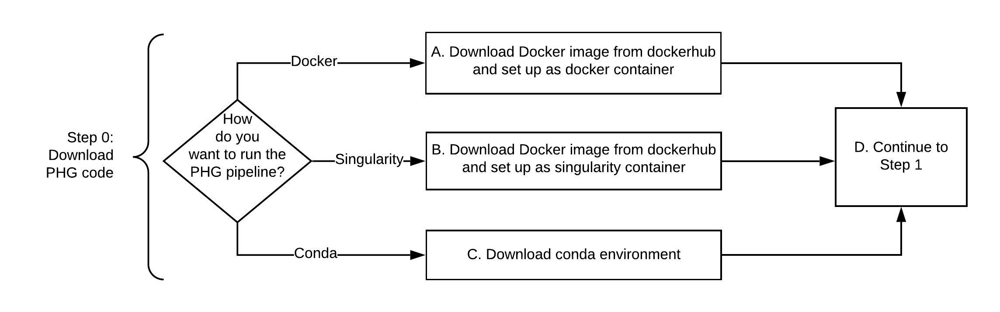

# Use the flow chart and links below to download the PHG code

A. [Run PHG with Docker](CreatePHG_step0_docker.md)

B. [Run PHG with Singularity](CreatePHG_step0_singularity.md)

C. [Run PHG with Conda](CreatePHG_step0_conda.md)

D. Test the Docker by creating and running an [example](ExampleDatabase.md) or 

E. [Proceed to Step 1](CreatePHG_step1-2_main.md)

[Return to Wiki Home](../Home.md)