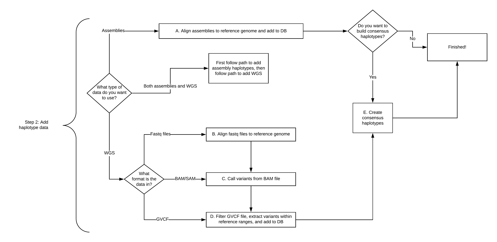

# Step 2: Add haplotypes to a database

# Step 2 pipeline includes several individual steps, some of which may be run in parallel.

All PHG haplotypes are created from GVCF files.  The recommended method of creating these GVCF files is by aligning assemblies to a reference genome and converting the output to bgzipped GVCF files along with a tabix'd version of the bgzipped file.  Using assemblies provides for more complete haplotypes and better calling of long indels.  However, not every species has multiple assembled genomes. For those species, GVCF files created by aligning WGS fastq files to a reference genome may be used to create PHG haplotypes. In both cases, GVCF files are the vehicle for creating the PHG haplotypes.

** Important: ** A GVCF file contains more information than a regular VCF file. We use the [GATK GVCF format](https://gatk.broadinstitute.org/hc/en-us/articles/360035531812-GVCF-Genomic-Variant-Call-Format) for the PHG.

The major architectural difference between PHG version 1 and the versions that preceded it is in the storage of haplotype variant information.  In previous releases, these variants were stored in the database, originally in the haplotypes table, and in later versions, in their own table.  While it was convenient to have all data stored in the database, these tables became very large and adversely affected database performance. As the number of variants increased, the processing time involving these variants also increased, often to levels where processing hung.

To counter-act this behavior, we made the decision to store all variant information in the original gvcf files external to the database, but optionally on the same server.  There will be 2 files stored for each genome:  a bgzipped version of the gvcf, and a tabix'd version of the bgzipped file.  While this requires a bit more work on the part of the user, it greatly increases processing speed in the PHG while allowing variants to be stored in a standard format compatible for processing with other bioinformatics applications.

When loading the haplotypes, the user specifies via parameters the location of the external gvcf folder.  This data is then stored to the PHG database table "genome_file_data".  Once haplotypes have been created and stored from the gvcfs files, the user must arrange for these files to be stored to an accessible, central location as specified by the gvcfServerDir parameter.  Prior to running any PHG code that requires haplotype variant information, the user must download the gvcf files (*.gz and *.gz.tbi files) to the local server where data processing will occur.  

A new "localGVCFFolder" parameter that holds the local location of these files is now required in the following plugins.  This parameter is used for accessing the files when variant information is requested:

* HaplotypeGraphBuilderPlugin
* HaplotypeGraphStreamBuilderPlugin
* ImputePipelinePlugin
* MakeInitialPHGDBPipelinePlugin
* PopulatePHGDBPlugin (we do not recommend the use of this plugin)

The "gvcfServerPath" column must be in the keyfiles that are passed as parameters to the following plugins/functions.  This value is stored to the PHG genome_file_data table where it records the server/path where these files are stored externally. This is expected to be the more "permanent" home for these files, and is the link from which a user will download the files to his local server:

* LoadAllIntervalsToPHGdbPlugin (new column in the file sent as the "genomeData" parameter)
* LaodHaplotypesFromGVCFPlugin (new column in the file sent as the "wgsKeyFile" parameter)
* PopulatePHGDBPipelinePlugin (parameter used when creating the gvcf key file - note, we do not recommend using this plugin)

** A. Align assemblies to reference genome, add to DB. **

Any alignment method may be used to create the GVCF files needed for loading haplotypes to the PHG database.  We recommend using the [anchorwave program](https://www.pnas.org/doi/10.1073/pnas.2113075119) for genome alignment.  Anchorwave alignment can be memory and processing intensive but the quality of alignment has been shown to be superior to other alignment methods. Anchorwave can take up to 50G per thread when aligning a single genome.  We recommend you run your alignments separately on one or more machines, convert the resulting MAF files to bgzipped/tabix'd GVCF files, then copy these files (both the bgzipped and tabix'd versions) to the machine from which you will load your database. 

Processing alignments via mummer4 is available in previous editions of the PHG software, but not with the new versions that process GVCF files into haplotypes.  Should you wish to continue to use mummer4, you can align outside of the pipeline software, and use a tool e.g. [mummer-2-vcf](https://www.biostars.org/p/395210/) for conversion.

Specifics on running anchorwave through the PHG pipeline are described below

1. [Align assemblies using anchorwave aligner](CreatePHG_step2_assemblyViaAnchorwave.md)

** B. Create haplotypes from WGS fastq files **

1. [Align WGS fastq files to reference genome](CreatePHG_step2_addHapsFromFastq.md)

2. [Call variants from BAM file](CreatePHG_step2_addHapsFromBAM.md)

3. [Filter GVCF, add to database](CreatePHG_step2_addHapsFromGVCF.md)

** C. Creating consensus **

1. [Create consensus haplotypes](CreatePHG_step2_consensus.md)

** D.  Optional: group your PHG taxa **

1. [Optionally, set up groups of PHG taxa](CreatePHG_step2_taxaGroupTables.md)

[Return to PHG version 1.0 Home ](../Home_variantsInGVCFFiles.md)

[Return to Wiki Home](../Home.md)
