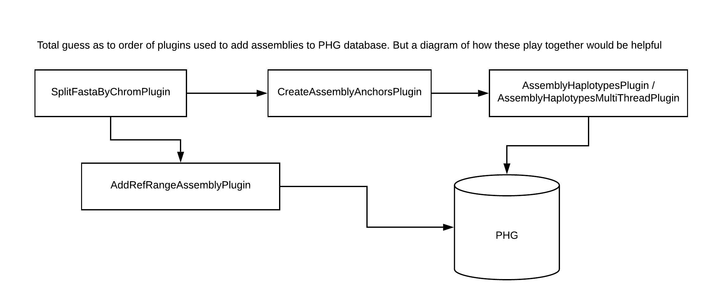

# Align assemblies to reference genome

## Instructions

## Details

The load assembly step uses mummer4 scripts to align a reference fasta file to the assembly fasta file. This is done on a chromosome-by-chromosome basis, and the *Quick Start* pipeline automatically splits the reference fasta into single chromosomes for the alignment. The fasta ID line for these files should contain the chromosome name with a space between the chromosome name and any additional information on the ID line and chromosome names between the reference and assembly genomes must be consistent.

The pipeline runs mummer4 nucmer, delta-filter, show-coords, and show-snps scripts and then processeses and reformats data for the PHG. 

## Parameters

Required parameters:

* configFile: DB Config File containing properties host,user,password,DB and DBtype where DBtype is either "sqlite" or "postgres". This file is expected to live in the folder mounted to Docker tempFileDir/data/.
* referenceFasta: The reference fasta file. This file is used when running Mummer4 alignment scripts. If running this step on the command line, this parameter is set in the config file directly. If running through the docker, this file is expected to live in the folder mounted to Docker /tempFileDir/data/reference. The SplitFastaByChromPlugin automatically separates the reference and assembly fastas into chromosomes, so the user does not need to do that.
* assemblyFastaDir: The directory containing all assembly fasta files to be added to the database. The SpliteFastaByChromPlugin automatically separates the reference and assembly fastas into chromosomes, so the user does not need to do that. The individual chromosome files are used to align against the respective reference chromosome when the mummer4 scripts are run. If running this step on the command line, this parameter is set in the config file. If running through the coker, this file is expected to be in the folder mounted to Docker path /tempFileDir/data/assemblyFasta.
* assemblyName: name to append to the output files that identifies the assembly processed. This is also the name that will be stored in the database genotypes table. To differentiate the assembly from other instances of taxa with this name, you may want to name it <taxa>\_Assembly. There cannot be duplicate assembly names in the database.
* chromList: A list of chromosome names that will be processed. This must match the chromosome names as stored on the ID line in the fasta file, or can be just the chromosome number if the chromosome is listed as "chr1" or "chromosome1". Chromosome names must match between the assembly and reference genomes. Note if leading 0's are added to the chromosome name, they must be consistently added in both assembly fasta, reference fasta, and this shell parameter.
* clusterSize: The minimum length for a cluster of matches used when running mummer4 nucmer program. Nucmer default is 65 but we have found when running maize assemblies 250 is faster and provides good results. That is the default we show below.
* assemblyQuality: Either 0 or 1 indicating assembly quality. If working with an assembly that has been scaffolded into chromosomes that approximately match chromsomes in the reference genome, set this parameter as 1. If working with an assembly that has been scaffolded but not built to chromosome-level, set this parameter to 0. There are two pipelines for adding assembly data to the PHG. The 1 flag for this parameter runs the highQualityAssemblyPlugin pipeline, while the 0 flag for this parameter runs the lowQualityAssemblyPlugin pipeline. 
* addAssemblyMethod: Either "parallel" or "sequential". When there are multiple assemblies to add to the database, the PHG code can add them one by one or in parallel. The outcome is identical regardless of which step is used, but memory usage and timings will differ.
* keyfile: The keyfile must be a tab-delimited file with 1 row for each per-chromosome assembly fasta you wish to align and load to the database. The required columns for the keyfile are RefDir, RefFasta AssemblyDir, AssemblyFasta, AssemblyDBName and Chromosome. Example assembly keyfiles for a single [taxon](../Files/assemblies_keyfile1.txt) or for [multiple taxa](../Files/assemblies_keyfile2.txt). The column descriptions are below.
    * RefDir: full path to the directory containing the reference fasta file.
    * RefFasta: name of the reference fasta file to be aligned to the assembly fasta file in this row. This should be a fasta file at the chromosome level.
    * AssemblyDir: full path to the directory containing the assembly fasta files.
    * AssemblyFasta: name of the assembly fasta file to be aligned to the reference fasta file in this row. This should be a fasta file at the chromosome level.
    * AssemblyDBName: the name for this assembly to add as the "line_name" to the database's genotype table.
    * Chromosome: the chromosome name that is being processed. This name must match a reference chromosome that was loaded with the LoadGenomeIntervals.sh script.

Optional parameters:

* mummer4Path: If the mummer4 executables exist in a path other than /mummer/bin, then provide that path via this parameter. If you are running in the PHG docker, the path will be /mummer/bin and this parameter is not necessary.
* clusterSize: This is a parameter to mummer4's nucmer alignment program. It sets the minimum length for a cluster of matches. We have found the value of 250 provides good coverage with acceptable speed.If you wish a different value, set this parameter.
* minInversionLen: Minimum length of inversion for it to be kept as part of the alignment. Default is 7500
* Boolean: true means load haplotypes to db, false means do not populate the database. Useful if the user is running mummer4 alignments on multiple machines and plans later to put all mummer4 files on 1 machine to load to a single database. Defaults to true
* numThreads: Number of threads used to process assembly chromosomes. The code will subtract 2 from this number to get the number of worker threads. It leaves 1 thread for IO to the DB and 1 thread for the Operating System.
* entryPoint: The "entryPoint" parameter is provided for users who wish to speed up processing by running the mummer4 alignments on multiple machines. You may do this, then gather all the mummer files to a single machine. If you do this, set the loadDB flag to FALSE, run all your alignments, then gather them to a single machine for loading into the database. This parameter indicates at which point assembly processing should begin. If a step other than "all" is chosen, files normally created from the previous steps must be present in a sub-directory named "align" in your output directory. They must be named using the format shown below for the software to recognize them:
    * all: Run the entire pipeline.  The software creates all necessary files.
    * deltafilter:  Assumes the nucmer aligning step has already been performed. Processing starts with mummer4 delta-filter step includes running mummer4 show-coords on both the original alignment and the filtered alignment as well as mummer4 show-snps.  The delta file must be available in a sub-directory named "align" in the directory mounted to docker's /tempFileDir/outputDir/.  The file name must be in the format:
        * ref_<assemblyDBName from config file>_<chromosome from config file>_c<clusterSize>.delta
        * ex:  ref_W22_1_c250.delta
    * refilter: Assumes delta-filter and show-coords for both the delta and the delta-filter steps have been run. This step runs additional filtering to process overlapping alignments, remove embedded alignments and find a longest-path solution.Your output/align directory  must have the files for deltafilter plus:
        * ref_<assemblyDBName from config file>_<chromosome from config file>_c<clusterSize>.delta_filtered
        * ref_<assemblyDBName from config file>_<chromosome from config file>_c<clusterSize>.coords_orig
        * ref_<assemblyDBName from config file>_<chromosome from config file>_c<clusterSize>.coords_filtered
    haplotypes: This step takes the mummer4 output files and from them creates haplotype sequence fro the database.  If starting from this step, you must have the files from above plus:
        * ref_<assemblyDBName from config file>_<chromosome from config file>_c<clusterSize>.coords_filteredPlus_noEmbedded
        * ref_<assemblyDBName from config file>_<chromosome from config file>_c<clusterSize>.coords_final
        * ref_<assemblyDBName from config file>_<chromosome from config file>_c<clusterSize>.snps_prefiltered
        * ref_<assemblyDBName from config file>_<chromosome from config file>_c<clusterSize>.snps_final


### *Details on running this step with wrapper scripts*

When running this step on the command line, all file paths and parameters are set in the config file. The only call that needs to be run in the terminal is `phg loadAssembly /path/to/config.txt`. If you would like to overwrite the parameters set in the config file, you can do that by setting the parameters on the command line directly.

For example, to ignore the config file assembly name and set one directly, you could run:
```
phg loadAssembly -configFile /path/to/config.txt -assemblyName newAssembly1
```

### *Details on running this step through docker*

When LoadAssemblyAnchors is called as part of a Docker script, the Docker script expects these mount points:

* Mount localMachine:/pathToAssemblyFastas/ to docker:/tempFileDir/data/assemblyFasta
* Mount localMachine:/pathToDataDir/ to docker:/tempFileDir/data/
* Mount localMachine:/pathToOutputDir/ to docker:/tempFileDir/outputDir/
* Mount localMachine:/pathToReferenceFastaDir/ to docker:/tempFileDir/data/reference

Note the script will create a subdirectory named "align" under the /tempFileDir/outputDir/ directory. This is where the mummer4 programs output will be written.

All output from running this script will be written to files in the directory mounted to Docker /tempFileDir/outputDir/align.

An example Docker script that would call this shell script is below.  Note: you need to change the mounted user directories to match your own directory configuration.  The docker directories (right side of the count pair beginning with "tempFileDir" need to remain as shown here.  The file names, e.g. "config.txt" should match the names of your files.

This example runs through all 10 chromosomes for a particular assembly.  In this example, the assembly files are broken into fasta files name ph207chr1.fasta, ph297chr2.fasta, etc.  The reference fastas are broken by chromosome and are named b73chr1.fasta, b73chr2.fasta, etc.  You need to change those names to match your fasta file names.

```
#!python

#!/bin/bash
chromosomeList=${chromList}

for chrom in "${chromosomeList[@]}"
do

echo "Starting chrom ${chrom} "

docker run --name phg_assembly_container_chr${chrom} --rm \
        -v /workdir/user/mummer4_testing/output:/tempFileDir/outputDir/ \
        -v /workdir/user/mummer4_testing/data:/tempFileDir/data/ \
        -v /workdir/user/mummer4_testing/refFastas/:/tempFileDir/data/reference/ \
        -v /workdir/user/mummer4_testing/assemblyFastas/:/tempFileDir/data/assemblyFasta/ \
        -v /workdir/user/mummer4_testing/mummer_from_shellDocker/:/tempFileDir/outputDir/align/ \
        -t maizegenetics/phg:latest \
        /LoadAssemblyAnchors.sh configSQLite_docker.txt \
                b73chr${chrom}.fasta \
                ph207chr${chrom}.fasta \
                PH207_Assembly \
                ${chrom} \
                250


echo "Finished chrom  ${chrom} "
done
```

ParallelAssemblyAnchorsLoad runs similarly to LoadAssemblyAnchors. When ParallelAssemblyAnchorsLoad is called as part of a Docker script, the Docker script expects these mount points:

* Mount localMachine:/pathToDataDir/ to docker:/tempFileDir/data/
* Mount localMachine:/pathToOutputDir/ to docker:/tempFileDir/outputDir/

The script will create a subdirectory called "align" under the mounted output directory where mummer4 alignment files will be stored.

An example Docker script that would call this shell script is below.  Note: you need to change the mounted user directories to match your own directory configuration. The docker directories (right side of the count pair beginning with "tempFileDir") need to remain as shown here. The file names, e.g. "config.txt" should match the names of your files. And the "config.txt" and "parallelKeyFile_B204.txt" must live in the directory mounted to /tempFileDir/data/.

```
echo "Starting taxa B104"

docker1 run --name phg_assembly_container_B104 --rm \
        -v /workdir/${USER}/phg_assemblyParallel_test/DockerOutput/:/tempFileDir/outputDir/ \
        -v /workdir/${USER}/phg_assemblyParallel_test/DataFolders/:/tempFileDir/data/ \
        -v /workdir/${USER}/phg_nam_assemblies/B73/:/tempFileDir/referenceFastas/ \
        -v /workdir/${USER}/phg_nam_assemblies/B104/:/tempFileDir/assemblyFastas/ \
        -t phgrepository_test:latest \
        /ParallelAssemblyAnchorsLoad.sh config.txt \
                parallelKeyFile_B104.txt


echo "Finished taxa 104 "
```
Note: use docker1 if running on cbsu.

The --name parameter provides a name for the container.  This is optional.

The --rm parameter indicates the container should be deleted when the program finishes executing.  This is optional.

The -v directives are used to mount data from the user machine into the Docker.  The path preceding the ":" is the path on the user machine.  The directory path following the ":" are the paths inside the Docker where the user home directories will be mounted.

The -t directive indicates the Docker image of which this container will be an instance.  The last line tells the Docker container to run the LoadAssemblyAnchors.sh script which is found in the root directory.  The items following are the parameters to the LoadAssemblyAnchors.sh script.

### *Files*

**Config file**

An example can be found here: [Master config file](../Files/master_config.txt)

**Reference Fasta file**

Fasta file for the reference genome you want to use in the database

**Assembly Fasta file(s)**

Fasta files with genome assemblies you want to add to the PHG. These are read from the directory passed in the assemblyFastaDir parameter.

**Mummer4 output files**

Mummer3 output files are written to a directory called "align" in the output directory specified by the user. The output directory should be mounted to the Docker /tempFileDir/outputDir/align directory.

**Assembly key file**

The assembly key file must be a tab-delimited file with 1 row for each per-chromosome assembly fasta you wish to align and load to the database. The required columns for the keyfile are RefDir, RefFasta AssemblyDir, AssemblyFasta, AssemblyDBName and Chromosome. An example assembly keyfile for a single genome assembly can be found [here](../Files/assembly_keyfile1.txt). Note all fields are tab-delimited and because this is run in a docker, the reference and assembly directories are docker paths.

An example key file that has per-chromosome pastas for multiple species is shown [here](../Files/assembly_keyfile2.txt). Note that the assembly chromosome fasta files must exist in the same directory.

### *Plugins*

This step calls multiple plugins to add assemblies to the PHG. The plugins are called in the order SplitFastaByChromPlugin --> CreateAssemblyAnchorsPlugin --> AssemblyHaplotypesPlugin/AssemblyHaplotypesMultiThreadPlugin. AddRefRangeAssemblyPlugin is an optional step.



The assembly entries in the genotypes table will be defaulted to the following values:

* line_name:  the assembly name
* line_data: the mummer script parameters used with this version of PHG
* Ploidy:  1
* is_reference:  false
* isPhasedAcrossGenes: true
* isPhasesAcrossChromosomes: true

The assembly entries in the gametes table will be defaulted to the following values:

* hapNumber: 0
* Confidence:  1

The assembly entries in the methods table will be defaulted to the following values:

* method_type: DBLoadingUtils.MethodTYpe.ASSEMBLY_HAPLOTYPES
* name:  mummer4
* description:  the mummer script parameters used with this version of PHG ( same as genotypes:line_data

#### **SplitFastaByChromPlugin**

This plugin splits fasta by chromosome. It assumes the id line has a chromosome of the form >1, >chr1 or >chromosome1. All of the above forms (case insensitive) will be written with an id line of just the number, e.g. >1 or >2.

The "name" parameter is used as the basis of the name.  To this name will be appended the "chr" and chrom number and .fa. For example:  If the user gives "w22" as the name, the code will write files: w22chr1.fa, w22chr2.fa, etc.

The isGca parameter: The assemblies starting with GCA have long text in the idLIne, with the chromosome stuck in the middle. This plugin will correctly parse these lines. Other weird id lines are not supported and may need to be corrected manually before running through this plugin.

Seems each set of assemblies that arrives has a different signature for the idline. So I keep customizing. Consider this code to the "base" plugin.  On each run, if the idlines don't adhere to chr/chromosome/X or GCA, then user should run an altered version of this, or fix the idlines first.

The parameters to this plugin are:

* -fasta <Fasta File> Fasta File to split by chromosome. (REQUIRED)
* -name <Name> Name to give each file, e.g w22.  To this name will be appended 'chr' plus the chrom number plus .fa (REQUIRED)
* -outputDir <Output Directory> ath to write the split files (REQUIRED)
* -isGca <Is GCA> GCA fastas have long text as idLines.  These fasta will have their id lines specially parsed to extract the chromosome number.

#### **CreateAssemblyAnchorsPlugin**

This plugin takes an assembly genome fasta file, splits the sequence into contigs based on the presence of N's. Each contig begins at a defined allele (base of A,C,G or T) and ends when an N is encountered. N's are skipped, a new contig begins at the next non-N allele. The contig fasta is aligned against the reference genome using minimap2. Samtools mpileup command is used to generate a pileup of read bases aligning to the reference, limiting the pileup to the conserved region intervals. Bcftools are then used to create a gvcf file. Fastas created from the gvcf are loaded to the db via the LoadHapSequencesToDBPlugin.

Assembly inter-anchor regions are not identified at this time.

Tables populated via this method are:

* genotypes
* gametes
* gamete_groups
* methods
* haplotypes
* gamete_haplotypes

The parameters to this plugin are:

* -ref <Reference Genome File>  Reference Genome File for aligning against. (Default is null) (REQUIRED)
* -genomeFile <Assembly Genome> Path to assembly genome fasta from which to pull sequence for aligning.
* -genomeData <Genome Data File> A tab-delimited file containing genome specific data with columns: Genotype Hapnumber Dataline Ploidy Reference GenePhased ChromPhased Confidence Method MethodDetails RefVersion.  
* -outputDir <Output directory>  Path to output directory including trailing / that will be used when creating temporary output files.
* -intervals <Intervals File> Path to BED formatted file containing the intervals used when creating the reference genome intervals. The positions are 0-based, inclusive/exclusive. This is used in mpileup. (Default is null) (REQUIRED)
* -configFile <DB Config File> Path to config file containing DB parameters host, user, password, DB, type.  Used for making the database connection.  Type must be either "sqlite" or "postgres" to identify db type for connection.

The genome data file contents are described below:

* Genotype:  the nmae of the line as you want it to appear in the db genotypes table "name" column, e.g. "B104" or "B104_haplotype_caller"
* Hapnumber:  The 0-based chromosome number.  For inbreds, this is always 0.
* Dataline: Text description defining the line. This data will be stored in the "description" field of the genotypes table.
* Ploidy:  Number of chromosomes for this genome, the value to be stored in the "ploidy" field of the genome_intervals table.  Should be 1 for the reference.
* Reference:  a boolean field indicating if this genome is the reference (should be true for this plugin)
* GenePhased: a boolean field indicating if the genes are phased.  Should be false for the reference.
* ChromPhased:  a boolean field indicating if the chromosomes are phased.  Should be false for the reference.
* Confidence:  a float field indicating confidence in phasing.  Generally 1 when no phasing.
* Method:  a mathod name by which this version of the reference data can be identified.
* MethodDetails:  Text description defining the method used to create the reference (or indicating the AGP version)
* RefVersion: a version name used to identify the version of this reference data.

#### **AssemblyHaplotypesPlugin**

This plugin takes a reference fasta file containing sequence for a single chromosome and an assembly fasta file with sequence for a single corresponding chromosome. The fastas are aligned using mummer4 nucmer script with a cluster size of 250 and the --mum parameter (anchor matches are unique in both reference and query).  

The nucmer results are filtered using mummer4 delta-filter script with the -g option. The -g option provides a 1-1 global alignment not allowing rearrangments. Mummer script show-coords is run on both the original delta file created by nucmer, and the filtered delta created via delta-filter. Post-processing is done to add back inversions.

Mummer script show-snps is run using the post-processed coords file. The list of final-snps is stored in htsjdk VariantContext records. The haplotype sequence is pulled from the VariantContext records. For alignments that map to reference anchor regions, haplotype sequence and variant lists are created and loaded to the PHG database.

Both assembly anchor and inter-anchor regions are processed in this method.

Tables populated via this method are:

* genotypes
* gametes
* gamete_groups
* methods
* haplotypes
* gamete_haplotypes

The parameters to this plugin are:

* -ref <Reference Fasta File>  Reference Genome File for a single chromosome.  (Default is null) (REQUIRED)
* -assembly <Assembly Fasta File> Path to assembly fasta for a single chromosome from which to pull sequence for aligning.
* -outputDir <Output directory>  Path to output directory including trailing / that will be used when creating temporary output files.
* -dbConfigFile <DB Config File> Path to config file containing DB parameters host, user, password, DB, type.  Used for making the database connection.  Type must be wither "sqlite" or "postgres" to identify db type for connection.
* -version <version> Version name for the set of DB anchor/inter-anchor coorcinates as stored in the anchor_versions table (Default is null) (REQUIRED)
* -assemblyName <Assembly Name> Name of assembly taxon, to be stored as taxon name in the DB. (Default is null) (REQUIRED)
* -chrom <Chromosome Name> Name of chromosome as it appears both for the reference in the db genome_intervals table and in the fasta file idline for the assembly.  The chromosome name can be just a number, a number preceded by "chr" or a number preceded by "chromsome".  Reference and assembly need to be consistent.

#### **AssemblyHaplotypesMultiThreadPlugin** (optional)

The AssemblyHaplotypesMultiThreadPlugin plugin takes reference and assembly fastas, split by chromosome, and aligns them with mummer4 scripts. It performs the same functions as are executed when the LoadAssemblyAnchors.sh script is called, but will run the mummer4 alignment programs in parallel. The number of processes run concurrently is dependent on a user supplied thread count.

When determining the number of threads to run, please keep in mind the alignment of each ref-assembly fasta pair will take RAM commensurate with the size of the genomes. Consider the RAM limitations of your machine as well as the number of cores available.

The required input to this script is a configuration file with database connection information, a keyfile with fasta information and an output directory.  Both the configuration file and the keyfile must live in a local machine directory that is mounted to the docker's /tempFileDir/data directory if this is run via docker.

The ParalleleAssemblyAnchorsLoad.sh script uses the parameter cache option to load the configuration file into memory.  This is the -configParameters <configFile> directive given to the tassel run_pipeline.pl script used in the Docker container. if you run this plugin manually at the command line, you will need to include this yourself with a command similar to the one below:

```
/tassel-5-standalone/run_pipeline.pl -Xmx100G -debug \
-configParameters myConfigFile.txt \
-AssemblyHaplotypesMultiThreadPlugin  
	-keyFile myKeyFile.txt  \
	-outputDir /workdir/user/phg_assemblies/DockerOutput/ \
	-endPlugin
```

#### **AddRefRangeAsAssemblyPlugin** (optional)

This class was created to load a reference genome as an assembly.  The method is hard-coded to "mummer4", which is the assembly method name at the time of this writing. All the variants are reference records. The addition of these haplotypes allows for pulling 

* -ref <Reference Genome File>  Reference Genome File for aligning against. (REQUIRED)
* -configFile <Genome Data File> Path to config file for accessing/loading the DB (REQUIRED)
* -methodName <Method Name> Name of method used for processing. Should match the assembly or GATK method based on how user wants the ref haplotypes grouped (REQUIRED)


## Troubleshooting

1. If running through Docker, check that mount points are correct.
2. Check that chromosome names match between reference and assembly genomes.


[Return to Step 2 pipeline](CreatePHG_step1-2_main.md)

[Return to Wiki Home](../Home.md)


