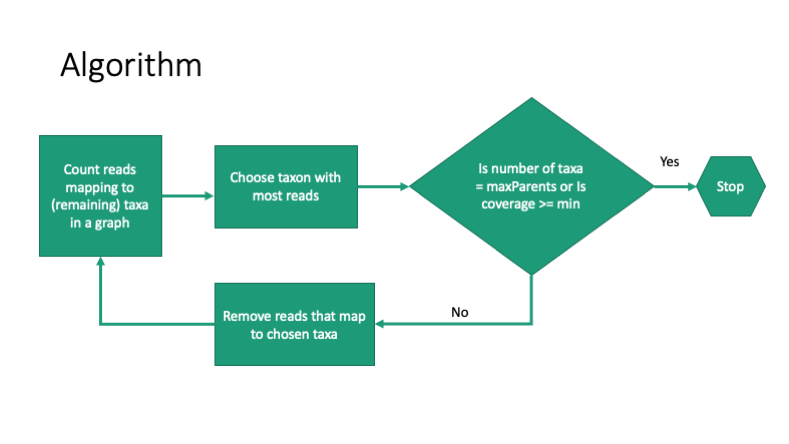

# Finding Likely Parents for Imputation

## LikelyParentsPlugin

The LikelyParentsPlugin uses read mapping results from the PHG database to determine which of the parents in a graph are
most likely to carry the same haplotypes as the sample that generated the read mappings. To run the plugin, a HaplotypeGraph
with all of the candidate parents must be built. Then, the number of reads mapping to each parent
is counted. The parent with the highest count is the first addition to the list of likely parents. The reads that mapped
to that parent are removed from the total set of read mappings, then using the remaining reads, the number of reads mapping
to each parent is again counted. The parent with the highest number of reads is added to the list of likely parents.
The process is repeated until a stopping condition is met. The plugin takes two parameters that determine the stopping condition,
maxParents and minCoverage. Coverage is defined as the number of reads mapping to any of the likely parents divided by the total
number of reads. Adding likely parents stops either when the number of likely parents equals maxParents or when the coverage 
is greater than or equal to minCoverage, whichever occurs first.

A name and path must be provided for an output file using the parameter "outFile". A report will be written to that file
with the headers sample_name, total_reads, parent, order, number_of_reads, and cumulative_reads. Total_reads is the total number
of reads in the read mapping record. Parent is one of the taxa in the HaplotypeGraph that was chosen as a likely parent. Order
is the order in which the likely parents were chosen. Number_of_reads is the number of reads that mapped to that parent but not to
any of the previously chosen parents. Cumulative_reads is the number of reads mapping to all the likely parents chosen up
to and including that parent.

## As Part of Path Finding

The same method is used as part of path finding for the default ("efficient") algorithms for haploid and diploid path finding. For path finding,
the default values of maxCoverage (1.0) and maxParents(Int.MAX_VALUE) mean that all taxa in the haplotype graph will be used 
for path finding. In that case, the likely parents method will not be used. It will only be used if 
maxParents < number of taxa in the haplotype graph or maxCoverage < 1.0.