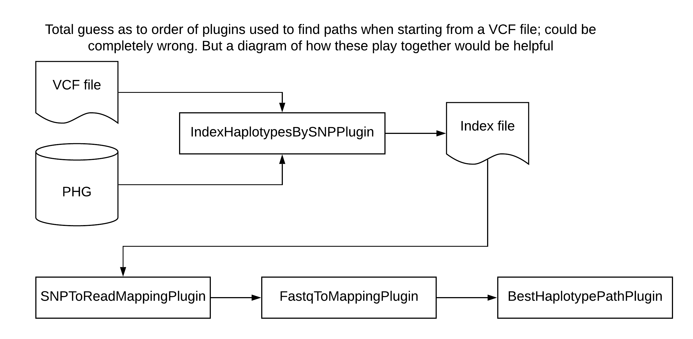

# Impute variants from a VCF file

#In progress, needs updating

## Quick Start

1. Change `input.vcf`, `param3`, and `param4` in your config file to match file paths on your computer.
2. Run `phg imputeFromVCF [config.txt]`

## Process Details

This process calls the SNPToReadMappingPlugin from tassel to assign haplotypes from variants in a VCF file. This bypasses the need for aligning reads to call haplotypes. These mapped haplotypes are then used for the Path and export vcf steps. A VCF is then created with variants from all reference ranges.  

## Kitchen Sink

This process calls the SNPToReadMappingPlugin which makes it possible to assign haplotypes from variants in a VCF file. We recommend that you only use this option if you do not have fastq data available and are very confident that the SNPs in the VCF are representative of the population you are working with.

There are XX parameters used in this step:

*add parameters and descriptions for whole step (reading VCF, comparing SNPs to PHG, predicting path through graph) when known*

* keyFile
* indexFile
* vcfDir
* outputDir
* methodName
* methodDescription
* countAlleleDepths
* another parameter?
* another parameter?

### *Details on running this step with wrapper scripts*

When running this step on the command line, all file paths and parameters are set in the config file. The only call that needs to be run in the terminal is `phg imputeFromVCF /path/to/config.txt`. If you would like to overwrite the parameters set in the config file, you can do that by setting the parameters on the command line directly.

For example, to ignore the config file vcfDir and set one directly, you could run:
```
phg findPaths -configFile /path/to/config.txt -vcfDir /path/to/vcf_files/
```

### *Details on running this step through docker*

### *Files*

**Config file**

An example can be found here: [Master config file](../Files/master_config.txt)

### *Plugins*

Four plugins are required to predict a path through the PHG database using SNPs from an input VCF file. The IndexHaplotypesBySNPPlugin indexes the pangenome and VCF files to make it possible to compare SNPs between them. It outputs an index file that is used by the SNPToReadMappingPlugin, which builds reads used by the FastqToMappingPlugin and BestHaplotypePathPlugin.



#### **IndexHaplotypesBySNPPlugin**

Creates an index file of the PHG by the SNP values contained within the database. The output is a file with 7 columns in the form:
```
refRangeId	chr	positionsrefAllele	altAllele	refHapIds	altHapIds
1	1	24	A	T	102,104	103
1	1	95	C	T	103,104	102
1	1	101	G	T	103,104	102
```

This index is then used in the SNPToReadMappingPlugin step to compare a VCF file with the index and create readMappings.

This plugin makes use of the graph stream so it is RAM efficient even though we are loading in the variants.

Steps:

1. Get a RangeMap of position to reference range Ids (used for fast lookup for what haplotypes to pull out for each SNP in VCF
2. Associate each SNP with a reference range and add to a map
3. Get the graphStream with Variants
4. For each Reference range, go through each Haplotype's SNP list and check to see if they are one of the SNPs to score
  * If so, add to either the reference or alternate list
5. Collect the results from the graphStream
6. Output the results to the index file.

The IndexHaplotypesBySNPPlugin takes 4 parameters.

* -vcfFile <VCF File> Name of the VCF file which holds the initial mappings to a single reference. (REQUIRED)
* -outputIndexFile <Index File Output> Index file output (REQUIRED)
* -configFile <Config File> Database configuration file (REQUIRED)
* -methods <Methods> Pairs of methods (haplotype method name and range group method name). Method pair separated by a comma, and pairs separated by colon. The range group is optional \n" + "Usage: <haplotype method name1>,<range group name1>:<haplotype method name2>,<range group name2>:<haplotype method name3> (REQUIRED)

The IndexHaplotypeBySNPPlugin requires a haplotype graph, which can be obtained by chaining the HaplotypeGraphBuilderPlugin to the IndexHaplotypeBySNPPlugin. Here is an example of how to do that:
```
example code needed here
```

#### **SNPToReadMappingPlugin**

This plugin takes as input a VCF file. It uses the SNP positions in the VCF and compares these to positions in the reference genome in the PHG. It builds 150bp Illumina reads using the SNPs in the VCF file, filling in non-SNP positions with reference sequence, then uses these reads with the FastqToMappingPlugin and BestHaplotypePathPlugin to identify the best path through the graph. 

The SNPToReadMappingPlugin requires output from the IndexHaplotypesBySNPPlugin. It takes 7 parameters.

* -keyFile <Key File Name> Name of the Keyfile to process.  Must have columns flowcell_lane and filename. In the filename column a VCF file needs to be specified.  The taxa name will be pulled from the VCF. (REQUIRED)
* -indexFile <Index File Name> Name of the SNP to HapIdList index file created by IndexHaplotypesBySNPPlugin (REQUIRED)
* -vcfDir <VCF Dir> Directory of VCF files (REQUIRED)
* -outputDir <Output dir> Read Mapping Output Directory (REQUIRED)
* -methodName <Method Name> Method name to be stored in the DB (REQUIRED)
* -methodDescription <Method Description> Method description to be stored in the DB (REQUIRED)
* -countAlleleDepths <true | false> Use the Allele Depths as the counts for the Read Mappings instead of SNPs (OPTIONAL)

Example for how to run the SNPToReadMappingPlugin using TASSEL plugins:
```
perl /tassel-5-standalone/run_pipeline.pl -debug ${fullXmx} \
-SNPToReadMappingPlugin \
	-keyFile ${keyFile} \
	-indexFile ${index} \
	-vcfDir ${VCF} \
	-outputDir ${output_dir} \
	-methodName method1 \
	-methodDescription ${description} \
	-countAlleleDepths true
	-endPlugin
```

#### **FastqToMappingPlugin**

The FastqToMappingPlugin executes code to count the number of reads which align to a haplotype node using Minimap 2. 

If running in paired mode, it will align the read pairs using minimap and process the resulting SAM records. Only equally optimal mappings (by Edit Distance (NM) are kept. Additional filtering is done to remove reads which are unmapped or clipped. 

If running in paired mode, the reads must be on opposite strands and both must currently hit the same haplotype in a single reference range. Optimal mappins across reference ranges are processed, but reads are only assigned to haplotypes in the reference range with the most hits (providing that at least 1-maxRefRangeError percentage hit that reference range). Based on testing, this seems to work the best to balance the number of reads used with accuracy. The plugin requires a PHG Haplotype Graph, which can be acquired by chaining the running of HaplotypeGraphBuilderPlugin and this plugin. 

The output from the HaplotypeGraphBuilderPlugin will be input to the BestHaplotypePathPlugin.

The parameters for this plugin are:

* -configFile <Config File> DB Config File containing properties host,user,password,DB and DBtype where DBtype is either sqlite or postgres (Default=null) (REQUIRED) A sample config file can be found here:[Master Config File](../Files/master_config.txt).
* -minimap2IndexFile <Minimap2 index file for pangenome> : Name of the indexFile file to process (required)
* -keyFile <keyFile> : Name of the Keyfile to process. Must have columns cultivar, flowcell_lane, filename, and PlateID. Optionally for paired end reads, filename2 is needed. If filename2 is not supplied, Minimap2 will run in single end mode. Otherwise will be paired. (required)
* -fastqDir <Fastq dir to process> : Name of the Fastq dir to process. (required)
* -maxRefRangeErr <Max Ref Range Err> : Maximum allowed error when choosing best reference range to count.  Error is computed 1 - (mostHitRefCount/totalHits) (Default: 0.25)
* -lowMemMode <true | false> : Run in low memory mode. (Default: true)
* -maxSecondary <Max Secondary> : Maximum number of secondary alignments to be returned by minimap2. This will be the value of the -N parameter in the minimap2 command line. If the value is too low, some valid read mappings will not be reported. (Default: 20)
* -minimapLocation <Location of Minimap2 Executable> : Location of Minimap2 on file system.  This defaults to use minimap2 if it is on the PATH environment variable. (Default: minimap2)
* -methodName <Method Name> : Method name to be stored in the DB. (required)
* -methodDescription <Method Description> : Method description to be stored in the DB. (required)
* -debugDir <Debug Directory to write out read Mapping files.> : Directory to write out the read mapping files.  This is optional for debug purposes. (Default: )
* -outputSecondaryStats <true | false> : Ouptput Secondary Mapping Statistics such as total AS for each haplotype ID (Default: false)

The FastqToMappingPlugin requires a haplotype graph, which can be obtained with the HaplotypeGraphBuilderPlugin. An example for chaining these plugins is below:
```
perl /tassel-5-standalone/run_pipeline.pl -debug ${fullXmx} \
-configParameters ${CONFIGFILE} \
-HaplotypeGraphBuilderPlugin \
	-configFile ${CONFIGFILE} \
	-methods ${HAPLOTYPE_METHOD} \
	-includeVariantContexts false \
	-includeSequences false \
	-endPlugin \
-FastqToMappingPlugin \
	-minimap2IndexFile ${HAPLOTYPE_INDEX} \
	-keyFile ${KEY_FILE} \
	-fastqDir ${FASTQ_DIR}/ \
	-methodName ${HAP_COUNT_METHOD} \
	-methodDescription READ_MAPPING_DESCRIPTION \
	-debugDir $OUTPUT_DIR \
	-endPlugin
```

#### **BestHaplotypePathPlugin**

This plugin takes a haplotype graph and a set of read mappings to infer the best (most likely) path through the graph given the read mappings. Read mappings are a list of reads with a set of haplotypes to which that read aligned. 

The plugin can (1) take a file of read mappings and return a file with a list of haplotypes or (2) take read mappings from a PHG DB and store the resulting list of haplotypes in the DB.

If (1), the input is a file, then the plugin can take either a file or a directory containing multiple files. If a directory, all read mapping files will be processed and the haplotype lists output as separate files to an output directory. If the output directory is not specified, then the lists will be written to the input directory. Any path files of the same name will not be overwritten; a message will be written to the log to that effect, unless the "overwrite" flag is set to true.

If (2), the input comes from a PHG DB, an input read map method and the output path method must be supplied. In addition, a specific taxon or list of taxa for which paths are to be imputed can be suppled. If paths for any of the taxa and methods exist, the paths will not be imputed and a warning message will be written to the log file. If the "overwrite" flag is set to true, any existing paths will be overwritten and a message to that effect will be written to the log. 

The parameters for this plugin are:

* -keyFile <Key File> : KeyFile file name.  Must be a tab separated file using the following headers: SampleName	ReadMappingIds	LikelyParents
    * ReadMappingIds and LikelyParents need to be comma separated for multiple values (required)
* -readFile <Read Map File> : Filename of read mappings. Do not supply both a filename and a directory.
* -readDir <Read Map Directory> : Directory of read mapping files. If this is supplied, do not also assign a read filename.
* -outDir <Path Output Directory> : Directory to which path files will be written.
* -readMethod <Read Mapping Method> : The name of the read mapping method in the PHG DB (required)
* -pathMethod <Path Method> : The name of the path method used to write the results to the PHG DB (required)
* -overwrite <true | false> : If an output pathfile already exists for a taxon, then it will be overwritten if overwrite = true. Otherwise, it will not and a warning will be written to the log. Likewise for paths in the PHG DB. (Default: false)
* -minTaxa <Min Taxa> : minimum number of taxa per anchor reference range. Ranges with fewer taxa will not be included in the output node list. (Default: 20)
* -minReads <Min Reads> : minimum number of reads per anchor reference range. Ranges with fewer reads will not be included in the output node list. (Default: 1)
* -maxReads <Max Reads> : maximum number of include counts per anchor reference range Kb. Ranges with more reads will not be included in the output node list. (Default: 10000)
* -maxNodes <Max Nodes> : maximum number of nodes per reference range. Ranges with more nodes will not be included in the output node list. (Default: 1000)
* -minTransitionProb <Min Transition Prob> : minimum probability of a transition between nodes at adjacent reference ranges. (Default: 0.001)
* -probCorrect <Prob Correct> : minimum number of reads per anchor reference range. Ranges with fewer reads will not be included in the output node list. (Default: 0.99)
* -splitNodes <true | false> : split consensus nodes into one node per taxon. (Default: true)
* -splitProb <Split Prob> : When the consensus nodes are split by taxa, this is the transition probability for moving from a node to the next node of the same taxon. It equals 1 minus the probability that the path will switch between taxa. (Default: 0.99)
* -usebf <true | false> : Use the Backward-Forward algorithm instead of the Viterbi algorithm for the HMM. (Default: false)
* -minP <Min P> : Only nodes with minP or greater probability will be kept in the path when using the Backward-Forward algorithm, (Default: 0.8)
* -bfInfoFile <Bf Info File> : The base name of the file to node probabilities from the backward-forward algorithm will be written. taxonName.txt will be appended to each file.
* -removeEqual <true | false> : Ranges with equal read counts for all haplotypes should be removed from the graph. Defaults to true but will be always be false if minReads = 0. (Default: true)
* -numThreads <Num Threads> : Number of threads used to find paths. The path finding will subtract 2 from this number to have the number of worker threads.  It leaves 1 thread for IO to the DB and 1 thread for the Operating System. (Default: 3)
* -requiredTaxa <Required Taxa> : Optional list of taxa required to have haplotypes. Any reference range that does not have a haplotype for one of these taxa will not be used for path finding. This can be a comma separated list of taxa (no spaces unless surrounded by quotes), file (.txt) with list of taxa names to include, or a taxa list file (.json or .json.gz). By default, all taxa will be included.
* -algorithmType <Algorithm Type> : the type of algorithm. Choices are classic, which is the original implementation described by Rabiner 1989, or efficient, which is modified for improved computational efficiency. \[classic, efficient\] \(Default: efficient\)

The BestHaplotypePathPlugin requires a haplotype graph, which can be obtained with the HaplotypeGraphBuilderPlugin. An example for chaining these plugins is below:
```
/tassel-5-standalone/run_pipeline.pl -debug ${fullXmx} \
-configParameters ${CONFIGFILE} \
-HaplotypeGraphBuilderPlugin \
	-configFile ${CONFIGFILE} \
	-methods ${HAPLOTYPE_METHOD_FIND_PATH} \
	-includeVariantContexts false \
	-includeSequences false \
	-endPlugin \
-BestHaplotypePathPlugin \
	-keyFile ${PATH_KEY_FILE} \
	-outDir ${HAP_COUNT_BEST_PATH_DIR} \
	-readMethod ${HAP_COUNT_METHOD} \
	-pathMethod ${PATH_METHOD} \
	-endPlugin
```

## Troubleshooting


[Return to Step 3 pipeline](ImputeWithPHG_main.md)

[Return to Wiki Home](../Home.md)