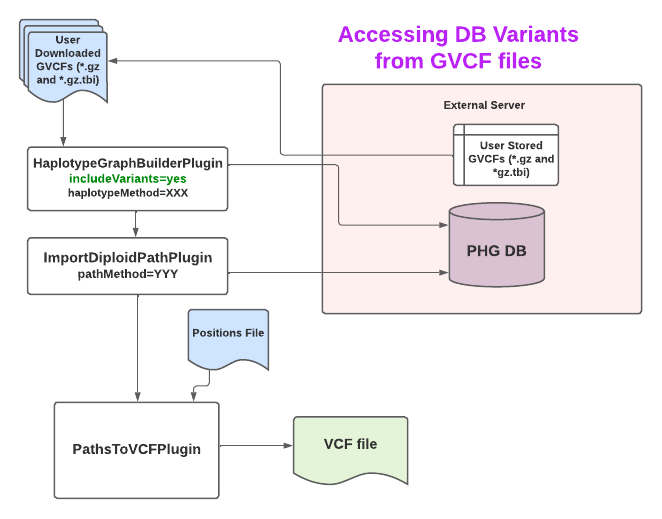

# Step 3: Impute variants with the PHG

This step uses stored haplotype graph data to infer genotypes from skim sequence, GBS data, or other variant information. It uses the input fastq or variant files to match new individuals to haplotypes in the database and generates paths through the haplotype graph. Paths are stored in the database paths table once they are found. The path information can be output as either haplotype node IDs from the haplotypes table or exported to a VCF file containing SNPs for the taxa processed.

# Quick Start

1. Write a config file and fill in the unassigned values.
1. Create a keyfile with information about reads to be imputed.
1. Run one of the commands in the examples section.

# Details

## Writing a config file
Before running the pipeline, you need to create a config file and put it in "baseDir" or some other directory accessible by the Docker. The config file name does not have to be config.txt. It also can be in any subdirectory of baseDir as long as the same file name location is used for -configParameters in the full pipeline command. 
Two sample config files are provided, one for imputing haplotypes from sequence in [fastq or SAM files (_link here_)](../Files/sample_fastq_imputation_config.txt) and another for imputing haplotypes from variants in a [VCF file (_link here_)](../Files/sample_vcf_imputation_config.txt). 
Values of **UNASSIGNED** in a config file must be filled in before using it. See the section [Setting parameters in the config file](#markdown-header-setting-parameters-in-the-config-file) for more information about what those values should be.

## To run the pipeline
The pipeline is run using a single TASSEL pipeline command. All of the parameters used by the pipeline are set in the config file. The following Docker command can be used to run the full pipeline, replacing baseDir, dockerImageName, and -Xmx10G with the appropriate values:
`docker run --name pipeline_container --rm -v baseDir:/phg/ -t dockerImageName /tassel-5-standalone/run_pipeline.pl -Xmx10G -debug -configParameters /phg/config.txt -ImputePipelinePlugin -imputeTarget pathToVCF -endPlugin`
When the pipeline is run it starts at the beginning and runs to the target. Possible values for imputeTarget are config, pangenome, map, path, diploidPath, pathToVCF, and diploidPathToVCF. "pangenome" stops after writing a pangenome fasta and using minimap2 to index it. "map" stops after mapping the sequence or variants to the pangenome haplotypes. "path" stops after writing the imputed paths to the database. In each case, prior steps in the pipeline already completed will not be rerun but will be skipped instead. Thus, read mappings or paths already computed will not be over-written.

## Running the pipeline with different parameter settings

When reprocessing the same samples with different parameter settings, the method names **must** be changed. If the method names are not changed, then read mappings or paths will already exist for those sample names and will not be overwritten. If read mapping parameters used to create the pangenome change, new readMethod and pathMethod names must be used. If only path finding parameters change, then only change pathMethod. In that case the pipeline will use the existing readMethod data to compute new paths.

If an existing configuration file is modified with new parameter settings and method names, the new configuration file should be saved under a different name. The configuration files provide a record of how analyses were run.

Parameter values used for read mapping are stored in the database with readMethod the first time that method is used. If any of those parameter values are changed, then the readMethod name should be changed as well so that the database has an accurate record of parameter values associated with each method name. The same is true for pathMethod. Because the pangenome fasta and index are not stored in the database, the parameters used for the pangenome are not stored either. Instead, the haplotype method and indexing parameters are encoded in the file names.

## Using a different aligner to map reads

The PHG pipeline uses minimap2 to map reads to a pangenome created from haplotypes in the PHG database. Users can choose to use a different aligner by first creating the pangenome then using an alternative aligner to create SAM or BAM files, which can then be used as inputs to the pipeline instead of fastq files. To create a pangenome fasta, run the pipeline with -imputeTarget pangenome. After the pangenome is created, then an alternative aligner can be used to map reads to the pangenome reference. It the output is saved as either a SAM or BAM file, then the other pipeline imputeTargets can be run with inputType=sam set in the config file.


## Setting parameters in the config file

### Database Parameters

The database parameters are required to make a connection to the PHG database.They are

* host
* user
* password
* DBtype
* DB

The default values are those needed to connect to a SQLite database and must be changed if using PostgreSQL. "DB", which is the path to the database does not have a default and is required.

### Method names

* pangenomeHaplotypeMethod
* readMethod
* pathHaplotypeMethod
* pathMethod

The two xxxHaplotypeMethods must be set to a valid [haplotype method](HaplotypeMethod), which can be a haplotype method or a comma-separated list of refRange group: haplotype method pairs. The pangenomeHaplotypeMethod describes the set of haplotypes used to construct the pangenome fasta. It can be any of the method names assigned to haplotypes when they were added to the database from assemblies or WGS or can be a consensus haplotype method. Both the pangenome writing step and the read mapping step have to use the same value for pangenomeHaplotypeMethod. As long as the same configuration file is used for both steps that happens automatically. The pathHaplotypeMethod describes the set of haplotypes to be used for pathing. It can be the same as the pangenomeHaplotypeMethod or a subset of it.

The same data can be imputed in many ways using different combinations of parameter settings. Each combination of settings must be assigned a unique method name by the user and the resulting data is stored in the database under that method name. The parameter values for each method are stored in the database under "method description" as a JSON formatted string. The readMethod is associated with the read mapping parameters. If any of the read mapping parameters are changed, the method name should be changed as well. The pathMethod is a user assigned name that is associated with a particular set of path finding and read mapping parameters. 

### Key files

Key files contain a list of samples and files to be processed. The parameter "keyFile" names the key file used to generate read mappings. The pipeline generates two additional key files from that. The pathing step uses a key file with the same name as the named read mapping keyFile plus the extension "_pathKeyFile.txt". The file with an extension of "_mappingIds.txt" is the original keyFile with the database ids of the stored read mappings. Generally, this will not be needed but can be used to generate specialized analyses. After the pipeline has been run, the _pathKeyFile and _mappingIds can be found in the same directory as keyFile.

More information about keyfiles can be found [here](ImputeWithPHG_findPathKeyFiles)

### File locations

A few parameters are required to define expected locations of files. The default values work with the PHG Docker when MakeDefaultDirectoryPlugin is used to create directories. These parameters are as follows:

* pangenomeDir [default = /phg/outputDir/pangenome/]
* fastqDir [default = /phg/inputDir/imputation/fastq/]
* samDir [default = /phg/inputDir/imputation/sam/]
* minimapLocation [default = minimap2]
* outVcfFile [no default, must be assigned a value if writing a VCF file]

### Pangenome minimap2 index parameters

Check minimap2 manual for documentation

* indexKmerLength [minimap2 -k, default=21]
* indexWindowSize=11 [minimap2 -w, default=11]
* indexNumberBases=90G [minimap2 -I, default=90G]

### Read mapping parameters with default values

* lowMemMode [default=true]
* maxRefRangeErr [default=0.25]
* outputSecondaryStats [default=false]
* maxSecondary [default=20]
* fParam [default=f1000,5000]

*lowMemMode* is an option that was introduced to reduce memory usage. It works so well that we recommend always using this setting and will probably remove the parameter at some point.

When a read is mapped to a pangenome, it may map equally well to multiple haplotypes. All mappings with the lowest edit distance are used. When some of those reads map to different reference ranges, only those mapping to the most frequently hit reference range are used. If the proportion of the mappings to other reference ranges exceeds *maxRefRangeErr*, that read is discarded. When this parameter is set to a lower value, fewer reads are used but overall mapping accuracy may improve. The impact on final imputation accuracy depends on the pangenome being mapped and on other parameter settings. The optimal value for this parameter will need to be determined empirically.

*maxSecondary* is the minimap2 -N parameter. When a read maps equally well to more than one haplotype, which is often the case, minimap2 calls one of those mappings the primary alignment and the rest secondary alignments. *maxSecondary* is the maximum number of secondary alignments saved. For that reason, *maxSecondary* should be greater than or equal to the maximum number of haplotypes per reference range. Otherwise, there may be a loss of imputation accuracy. *fParam* is the minimap2 -f parameter.

### Pathing parameters with default values
                   
* maxNodes [default=1000]
* minReads [default=1]
* minTaxa [default=20]
* minTransitionProb [default=0.001]
* numThreads [default=3]
* probCorrect [default=0.99]
* removeEqual [default=true]
* splitNodes [default=true]
* splitProb [default=0.99]
* algorithmType [default=efficient]
* maxParents = [default = Int.MAX_VALUE]
* minCoverage = [default = 1.0]
* ###   used by haploid path finding only
* maxReads [default=10000]
* usebf [default=false]
* minP [default=0.8]
* ###   used by diploid path finding only
* maxHap [default=11]
* maxReadsKB [default=100]

Reference ranges with more than *maxNodes* number of nodes or fewer than *minTaxa* taxa will not be used for imputation.
For each sample, ranges are also eliminated that have fewer than *minReads* mapped to that range or more then *maxReads* (haploid pathing)
or *maxReadsKB* (dipoid pathing) reads per KB of reference sequence. If *removeEqual*=true and *minReads* > 0, ranges for which all taxa have the same 
number of reads mapping to them will be eliminated.

After any ranges have been removed due to the filter criteria, a node with a zero-length haplotype is added for all taxa that have no haplotype in any given reference range. If *splitNodes*=true, nodes with more than one taxon are split into individual taxa. The transition probability between nodes of the same taxon are set to *splitProb* and the transition probability between a taxon and any other taxon is set to (1 - *splitProb*) / (n - 1) where n = number of taxa in the graph. The minimum value for any transition is set to *minTransitionProb*. It is recommended that *minTransitionProbe* <= (1 - *splitProb*) / (n - 1). It is recommended that *splitNodes* not be set to false because this generally leads to lower imputation accuracy. If *splitNodes* = false, the transition probability is set to the proportion of times that transition is observed in the haplotypes in the database while unobserved transitions are set to *minTransition*.
 
The number of threads that will be used to impute individual paths is *numThreads* - 2 because 2 threads are reserved for other operations.
As a result, *numThreads* must be set to 4 or more in order to run pathing in parallel.

The *algorithmType*=classic uses the classic Viterbi (or forward-backward) algorithms. *algorithmType*=efficient uses a more efficient
version of the algorithms but is considered experimental at this time pending more extensive testing.

When *usebf*=false, the Viterbi algorithm is used for pathing. If *usebf*=true, the forward-backward algorithm is used and 
only nodes with a probability of *minP* or greater will be included in the final path. The forward-backward algorithm has been implemented 
for haploid path finding but not for diploid path finding.

For diploid path finding, only ranges with *maxHap* haplotypes or fewer will be used.

For path finding, the values of *maxParents* and *minCoverage* determine whether or not read mapping data is used to find the most likely parents
for each individual being imputed. If maxParents is less than the number of parents in the pathHaplotypeMethod or coverage is 
less than 1.0. Only the the most likely parents will be used for imputation. See the LikelyParentsPlugin for details.

### Optional parameters

* pangenomeIndexName
* readMethodDescription
* pathMethodDescription
* debugDir
* bfInfoFile
* parentOutputFile

To use the optional parameters in the configuration file, replace **OPTIONAL** with the appropriate value and uncomment the line.

*pangenomeIndexName is the name of an externally supplied pangenome index. It is best not to supply this values and instead to let the pipeline build and imdex the pangenome
 and assign the index name to ensure that it is compatible with the rest of the pipeline.
 
 *readMethodDescription* and *pathMethodDescription* are optional user descriptions for these methods which will be 
 included in the database description with the tag "notes=" in addition to the parameter values used for that method.
 
 If a value is supplied for *debugDir*, for each sample fastq a text file containing the read mapping haplotype counts will be written. The same data
 will stored in the database whether or not a value is assigned to *debugDir*. Generally this is not needed but may be useful
 for debugging obscure problems.
 
 When *usebf*=true, the forward-backward algorithm will calculate probabilities for every haplotype node in the graph. These values are used
 to determine which haplotypes are included in the path. If a value is supplied for *bfInfoFile* all of the haplotype probabilities
 will be written to that file.
 
If the most likely parents are found and used for imputation, then a report of which parents were chosen for each line being imputed
will be written to *parentOutputFile*, if it is set.

# Workflow Summary

The workflow proceeds through a few distinct steps as illustrated by the flowchart. They are

1. Write haplotypes to a pangenome.fa fasta
1. Map reads to the pangenome.fa using minimap2
1. Use the reads to find the most likely path for each taxon through the Haplotype Graph
1. Write a the variants on each path to a VCF file

# Examples: Executing workflows

In the examples below, all log and debug messages will be written to the console. To write them to a log file append 
` > /path/to/logfile` or ` &> /path/to/logfile`. In the first format, stdout will be written to the log file and stderr 
will be written to the console. In the second format, both stdout and stderr will be written to file. imputeTarget, which describes the endpoint at which the workflow will stop, must equal one of pangenome, path, diploidPath, pathToVCF, or diploidPathToVCF. All steps required to reach the endpoint will be executed. If any of the steps have already been run, they will not be repeated but will be skipped instead.

A. Create a pangenome Fasta File then stop

* config file parameters that need to be set: DB, pangenomeHaplotypeMethod
* command:
`docker run --name pipeline_container --rm -v baseDir:/phg/ -t dockerImageName /tassel-5-standalone/run_pipeline.pl -Xmx20G -debug -configParameters myConfigFile.txt -ImputePipelinePlugin -imputeTarget pangenome -endPlugin`
* result: The pangenome fasta will be written.

B. Impute variants from fastq files - homozygous

* parameter: inputType=fastq
* command:
`docker run --name pipeline_container --rm -v baseDir:/phg/ -t dockerImageName /tassel-5-standalone/run_pipeline.pl -Xmx20G -debug -configParameters myConfigFile.txt -ImputePipelinePlugin -imputeTarget path -endPlugin`
* result: Read mapping counts and imputed paths will be stored in the PHG database.

C. Impute variants from fastq files - heterozygous

* parameter: inputType=fastq
* command:
`docker run --name pipeline_container --rm -v baseDir:/phg/ -t dockerImageName /tassel-5-standalone/run_pipeline.pl -Xmx20G -debug -configParameters myConfigFile.txt -ImputePipelinePlugin -imputeTarget diploidPath -endPlugin`
* result: Read mapping counts and imputed paths will be stored in the PHG database.

D. Impute variants from a VCF file - homozygous

* parameter: inputType=vcf
* command:
`docker run --name pipeline_container --rm -v baseDir:/phg/ -t dockerImageName /tassel-5-standalone/run_pipeline.pl -Xmx20G -debug -configParameters myConfigFile.txt -ImputePipelinePlugin -imputeTarget path -endPlugin`
* result: Read mapping counts and imputed paths will be stored in the PHG database.

E. Export imputed VCF from fastq files - homozygous

* parameter: inputType=fastq
* command:
`docker run --name pipeline_container --rm -v baseDir:/phg/ -t dockerImageName /tassel-5-standalone/run_pipeline.pl -Xmx20G -debug -configParameters myConfigFile.txt -ImputePipelinePlugin -imputeTarget pathToVCF -endPlugin`
* result: Read mapping counts and imputed paths will be stored in the PHG database. Variants for all the paths stored for pathMethod will be written to a VCF file.

F. [View haplotypes with rPHG](https://bitbucket.org/bucklerlab/rphg/wiki/Home)

### Writing a VCF for a subset of haplotypes or paths

Writing a VCF for a subset of imputed paths or for haplotypes stored in the PHG database can be useful, but cannot be done using the ImputePipelinePlugin.
Instead the PathsToVCFPlugin must be called directly with a HaplotypeGraph containing the desired taxa 
Following are example commands for performing those tasks:

A. Write a VCF for a subset of assemblies (or WGS haplotypes) from the database. If the -taxa parameter is not used, SNPs for all the haplotypes
for the method specified by the -methods parameter will be output.

If running with PHG version 1.0 or greater, the GVCF Files used to stored the haplotype variants must first be downloaded to a local folder.  This folder is passed as a parameter to the HaplotypeGraphBuilderPlugin.  It can be specified along with other HapltoypeGraphBuilderPlugin parameters in the config file.  Then entry should look as below (replace the parameter value with your own local folder value - relative to docker if running the command via docker).

```python

HaplotypeGraphBuilderPlugin.localGVCFFolder=/phg/remoteGvcfs
```

The diagram below shows the flow when creating a VCF file from PHG paths.  If running with PHG version 0.0.40 or earlier, you will not have the external VCF files to download.  Otherwise, the work flow is the same between the earlier and later PHG versions.




Note that all parameters may be stored in the config file or passed specifically on the command line.

The VCF file is created by first calling HaplotypeGraphBuilderPlugin to create a graph that includes haplotypes based on the user specified methods.  This graph is passed along with a PATH method name and optional list of taxa to the ImportDiploidPathPlugin. The ImportDiplolidPathPlugin returns the graph along with a map of haplotype paths.  Finally, the data from the ImportDiploidPathPlugin output is sent as input to the PathsToVCFPlugin.

When running the PathsToVCFPlugin we recommend using a positions list to limit the number of entries in the output VCF File to something manageable.  The positions list can be specified by Genotype file (i.e. VCF, Hapmap, etc.), bed file, or json file containing the requested positions.

An example of chaining these plugin calls in a docker command is below.


```python

docker run --name pipeline_container --rm -v baseDir:/phg/ -t dockerImageName  \
   /tassel-5-standalone/run_pipeline.pl -Xmx200G -debug -configParameters <configFile> \
   -HaplotypeGraphBuilderPlugin -configFile <configFile> -methods haplotypeMethod1 \
         -includeVariantContexts true -includeSequences false -taxa taxon1,taxon2 -endPlugin \
   -ImportDiploidPathPlugin -pathMethodName pathMethod1 -endPlugin \
   -PathsToVCFPlugin -outputFile <vcfOutputFile> -referenceFasta <referenceFasta.fa> \
         -positions <positions> -endPlugin
```

An example of a singularity script to run these plugin calls for PHG version 1.0 or greater is below.

```python
WORKING_DIR=/workdir/lcj34/phg_testGVCFasVariants/
REMOTE_GVCF_DIR=/workdir/zrm22/remoteGvcfs/
DOCKER_CONFIG_FILE=/phg/configDockerPostgres_gvcf.txt
HAPLOTYPE_METHOD=NAM_CONSENSUS_mxDiv_10ToNeg4
POSITIONS_FILE=/phg/TUMPLANTBREEDING_Maize600k_elitelines_AGPv5_crossmapSORTED.vcf

# make sure configFile has all parameters needed for HaplotypeGraphBuilderPlugin and 
# ImportDiploidPathPlugin and PathsToVCFPlugin
# NOTe that include variants is TRUE - this is real vcf, not haplotypes
singularity exec -B ${WORKING_DIR}:/phg/ \
        -B ${REMOTE_GVCF_DIR}:/remoteGvcfs/ phgGVCF_v12.simg \
        /tassel-5-standalone/run_pipeline.pl -Xmx500G -debug -configParameters ${DOCKER_CONFIG_FILE} \
        -HaplotypeGraphBuilderPlugin -configFile ${DOCKER_CONFIG_FILE} -methods ${HAPLOTYPE_METHOD} \
        -includeVariantContexts true -endPlugin \
        -ImportDiploidPathPlugin  -endPlugin \
        -PathsToVCFPlugin -positions ${POSITIONS_FILE} -endPlugin

```
  
B. Write a VCF for a subset of paths

[Return to PHG version 1.0 or later home](../Home_variantsInGVCFFiles.md)

[Return to PHG version 0.0.40 or earlier  home](../Home_variantTables.md)

[Return to Wiki Home](../Home.md)
