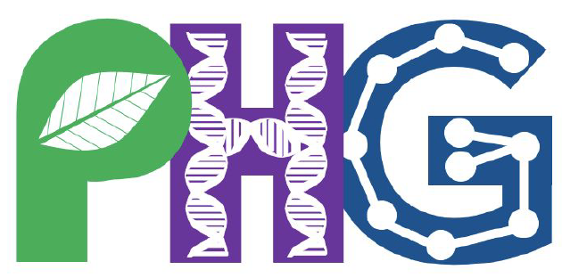

# [The Practical Haplotype Graph (PHG)](https://drive.google.com/open?id=1oavzrgqaA_FWKK077uAVQdDgGb683W_y)

With improved sequencing technology, sequencing costs are decreasing rapidly. But bioinformatics challenges for processing data and inferring genotypes have increased. To address this, we have developed a general, graph-based, computational framework called the Practical Haplotype Graph (PHG), that can be used with a variety of skim sequencing methods to infer high-density genotypes directly from low-coverage sequence. The idea behind the PHG is that in a given breeding program, all parental genotypes can be sequenced at high coverage, and loaded as parental haplotypes in a relational database. Progeny can then be sequenced at low coverage and used to infer which parental haplotypes/genotypes from the database are most likely present in a given progeny individual. 

The PHG is a trellis graph-based representation of genic and intergenic regions (called reference ranges) which represent diversity across and between taxa.  It can be used to: create custom genomes for alignment, call rare alleles, impute genotypes, and efficiently store genomic data from many lines (i.e. reference, assemblies, and other lines). Skim sequences generated for a given taxon are aligned to the graph to identify the haplotype node at a given anchor. All the anchors for a given taxon are processed through a Hidden Markov Model (HMM) to identify the most likely path through the graph. Path information is used to identify variants (SNPs). Low cost sequencing technologies, coupled with the PHG, facilitate the genotyping of large number of samples to increase the size of training populations for genomic selection models. This can in turn increase predictive accuracy and selection intensity in a breeding program.

A more detailed introduction can be seen in Peter Bradbury's [PHG presentation slides](Pipeline_version1/PAG_Bradbury_PHG_ver3.pdf) from the 2018 Plant and Animal Genome conference (PAG).

# Pipline versions

## PHG version 1.0 and beyond (variants stored in external GVCF files)

PHG Versions 1.0 and later store haplotype variant information in external GVCF files.  These files need to be bgzipped and tabix'd and then stored to a central location that is accessible for download when necessary for PHG graph processing.  The location of these files is stored in the PHG database table "genome_file_data" when the haplotypes they reference are loaded to the PHG database.  This method of variant storage/retrieval allows for the data to be stored in a standard format available for procesing with other bioinformatics applications.

For instructions on using a database based on the latest PHG version please click [here](https://bitbucket.org/bucklerlab/practicalhaplotypegraph/wiki/Home_variantsInGVCFFiles)

## PHG versions 0.0.40 and below (variants stored in database tables )

The original versions of the PHG software stored variant information in database tables.  While it was convenient to have all the data in a single place, these tables became very large and adversely affected database performance. As the number of variants increases, the processing time involving these variants also increases, often to levels where the program appears hung.  

The PHG software has since been re-written and starting with PHG version 1.0, variant data is now stored external to the database in GVCF formatted files.  These files are bgzipped and have an accompanying tabix'd file. The GVCF files are named <myname>.gvcf.gz and the tabix'd files are named <myname>.gvcf.gz.tbi.  It is the responsibility of the user to arrange for these files to be stored to an accessible, central location from which they can be downloaded when necessary for PHG graph processing.

While the PHG software uses liquibase migration tools to migrate basic database changes from one PHG version to another, it is not available to upgrade from a PHG version 0.0.40 or below to PHG version 1.0 or above. The changes between these 2 versions are too great for liquibase to be viable. 

If you have an existing PHG database created with version 0.0.40 or earlier you can continue to process using your existing PHG docker image.  Alternatively, you may rebuild your database using the new software. 

For instructions on using a database based on the older PHG version please click [here](https://bitbucket.org/bucklerlab/practicalhaplotypegraph/wiki/Home_variantTables) 

## Asking questions

Please use Biostars to ask for help. Instructions for using Biostars are [here](UserInstructions/help_biostars.md)

## Reporting bugs

The PHG is under active development. If you find a bug, please submit a [pull request](https://bitbucket.org/bucklerlab/phg-pipeline/pull-requests/) so that we can address it.

## Other ways to use the PHG

The [rPHG package](https://bitbucket.org/bucklerlab/rphg/wiki/Home) allows users to explore PHG databases in R.

The [rTASSEL package](https://bitbucket.org/bucklerlab/rtassel/wiki/Home) allows users to run TASSEL through R.

## PHG Papers

Jensen et al. 2020: [A sorghum practical haplotype graph facilitates genome‐wide imputation and cost‐effective genomic prediction](https://acsess.onlinelibrary.wiley.com/doi/full/10.1.02/tpg2.20009)

## Wheat PHG Hackathon (February 24-28, 2020): Cornell University - Ithaca

[Presentations](https://docs.google.com/presentation/d/1ypNrhVVufXNz2k6ksiQ5n1XgLJUPcTvnB-JPlR93JDs/edit#slide=id.p)

## Wheat CAP PHG workshop (July 8-12, 2019): Cornell University - Ithaca

[Agenda](https://drive.google.com/file/d/1-X4D00seUVF-ofkygDdRlMKHi4vYotVQ/view?usp=sharing)

[Presentations](https://drive.google.com/drive/folders/17aBkQnkUm5XHUgJITZwTf-NltYOz7C48)

## PHG Workshop (August 17-18, 2018): IRRI - Philippines

[Agenda](https://drive.google.com/file/d/10YIeHtHE0v4EdCg9U1mbhvcT4W6pXL5M/view?usp=sharing)

[Presentations](https://drive.google.com/drive/folders/1rnN1TtjRKvLITvvFDJL7dD0WMSpcIgPQ?usp=sharing)

## PHG Workshop (June 4-8, 2018): Cornell University - Ithaca

[Agenda](https://drive.google.com/file/d/1G7h1eqc_LZ7OV0FU3oOANTYsXyZVij9t/view?usp=sharing)

[Presentations](https://drive.google.com/drive/folders/1egsVyumoZLVkbSdv2TBelKPfID122fcT?usp=sharing)

## PHG @ PAG (January 13-17, 2018): Plant and Animal Genome XXVI Conference - San Diego 

[2018 PAG poster](DockerPipeline/Poster_PAG2018_PR.pdf)

[PHG presentation slides](DockerPipeline/PAG_Bradbury_PHG_ver3.pdf)